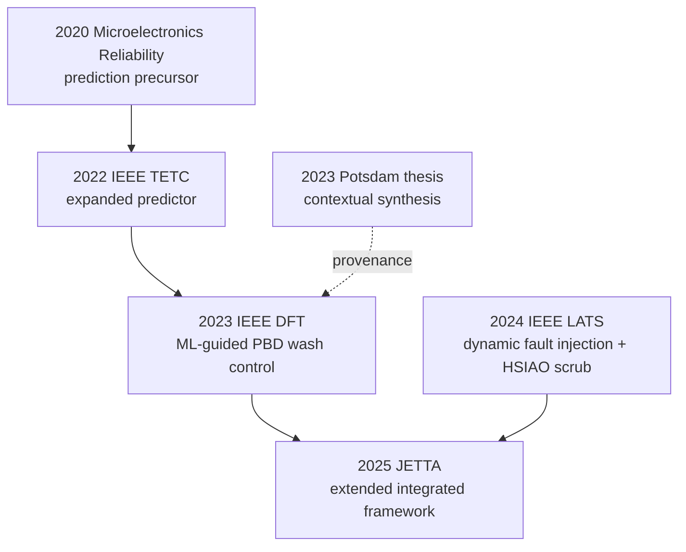

# Chen/IHP/Potsdam Adaptive-Control Prior Art — Identity Resolution

**Task ID:** `CONTROL-PRIOR-ART-IDENTITY-01`  
**Related scope:** future integrated adaptive-control RQ; RQ-004/RQ-005 dependencies  
**Role:** Literature Scout  
**Execution date:** 2026-08-28 (UTC)  
**Canonical repository:** `z3tm4n-x/phd-adaptive-memory-ecc`  
**Required scientific base:** `c55ba6447e6b1104a5f7ae7af9d3b072c44a6c02`  
**Report commit base:** `1961ec77d11b3d0ee56009d41b1cb361cfb1f369` (`main`, checked immediately before the one-file write)  
**Evidence level:** identity resolution and bounded feature screening; not novelty adjudication or a Paper Card.  
**Orchestrator status:** `ACCEPTED — IDENTITY/DISCOVERY ONLY` 

## Orchestrator acceptance boundary

The publication-family identity, DOI chain and version relationships are accepted as a discovery record. The report correctly resolves the ambiguous Chen/IHP/Potsdam reference and supplies a bounded full-text handoff. Its discovery-level feature descriptions are **not** accepted as paper-level evidence, permanent claims or a novelty conclusion.

The next controlled targets are:

1. the 2025 JETTA article, DOI `10.1007/s10836-025-06183-5`, as the consolidated source;
2. the 2023 DFT paper, DOI `10.1109/DFT59622.2023.10313560`, as the earliest explicit controller disclosure;
3. the 2024 LATS paper, DOI `10.1109/LATS62223.2024.10534594`, as the distinct dynamic-fault-injection/evaluation branch.

These three sources require a feature-by-feature full-text Paper Analyst comparison before any adaptive-control novelty statement. The 2020/2022 prediction papers remain upstream context and become separate deep-read targets only if the three-source comparison leaves a named observation/prediction-interface gap.

## 1. Disposition

**IDENTITY RESOLVED.** “Chen/IHP/Potsdam” is not one ambiguous paper. It is a related publication family with two identifiable lines that converge in a 2025 journal article:

1. a prediction line: a 2020 *Microelectronics Reliability* article followed by an expanded 2022 IEEE TETC article on SRAM-based monitoring and one-hour-ahead SEU/SPE prediction; and
2. a control/evaluation line: a 2023 IEEE DFT paper that explicitly maps predicted future memory faults to adaptive PBD wash frequency, a 2024 IEEE LATS paper that evaluates dynamic HSIAO-based scrubbing using time-dependent radiation-driven fault injection, and a 2025 JETTA article that explicitly states that it extends and systematizes the two conference works.

The closest consolidated full-text target for feature-by-feature analysis is:

> Junchao Chen, Li Lu, Marko Andjelkovic, Fabian Luis Vargas, and Milos Krstic, “Dynamic Fault Mitigation for Space Radiation Using Fault Injection and Machine Learning,” *Journal of Electronic Testing*, vol. 41, no. 3, pp. 273–285, 2025, DOI: [10.1007/s10836-025-06183-5](https://doi.org/10.1007/s10836-025-06183-5).

The closest first controller disclosure is the 2023 DFT paper, DOI [10.1109/DFT59622.2023.10313560](https://doi.org/10.1109/DFT59622.2023.10313560). It should be compared directly with the 2025 journal article rather than silently treated as a duplicate. The 2024 LATS paper is a related evaluation branch with a different EDAC case study and must also remain a separate record.

No novelty conclusion is made. No project reliability threshold is assigned. Numerical thresholds reported inside the papers are not imported into the project contract.

## 2. Bounded search frame

### 2.1 Identity question

Which exact Chen/IHP/University-of-Potsdam publication or publication family concerns radiation variation or prediction and adaptive adjustment of SRAM scrubbing/wash frequency, and which full text is the closest target for later feature-by-feature prior-art analysis?

### 2.2 Search concepts and synonyms

| Concept | Terms used |
|---|---|
| Identity | `Junchao Chen`, `IHP`, `Leibniz Institute for High Performance Microelectronics`, `University of Potsdam` |
| Environment/observation | `space radiation`, `solar particle event`, `SPE`, `SEU rate`, `SRAM monitor`, `fault statistics`, `radiation flux` |
| Prediction | `prediction`, `forecast`, `machine learning`, `one hour ahead`, `online learning` |
| Controlled action | `adaptive scrub frequency`, `dynamic scrubbing`, `wash frequency`, `wash rate`, `dynamic EDAC`, `PBD`, `HSIAO` |
| Relation | `previous work`, `conference work`, `extended`, `systematized`, DOI and reference-chain checks |

### 2.3 Inclusion and exclusion

**Included:** Chen-led IHP/Potsdam records that provide a traceable link in the monitoring/prediction-to-adaptive-mitigation chain, or that are explicitly identified by the closest journal article as its conference foundations.

**Excluded from the resolved core family:** general adaptive fault tolerance, inspection/maintenance/control scheduling, space-weather prediction without a Chen/IHP/Potsdam identity, unrelated Chen authors, and upstream SRAM-monitor or PBD implementation papers that do not themselves connect prediction/variation to the adaptive control question. Such records may appear only as cited technical dependencies, not as alternative identities for the target source.

## 3. Source access and reproducible search log

### 3.1 Access status

| Route | Status | Use in this task | Limitation |
|---|---|---|---|
| Canonical GitHub repository | ACCESSIBLE | Required instructions and project state read at `c55ba644…`; current `main` checked before write | Project state only; not literature evidence |
| IEEE Xplore | PARTIAL | DOI/title/venue metadata for 2022, 2023, and 2024 records | Automated page access was inconsistent; author-deposited/full-text copies were used where available |
| ScienceDirect | PARTIAL | DOI/title/venue metadata for the 2020 article | Publisher page was discoverable but automated full-text opening was blocked |
| Springer/JETTA | PARTIAL | DOI, journal, dates, pages, and publisher preview for the 2025 article | Publisher access route was not open in Scite; a user-held publisher PDF was available |
| University of Potsdam `publish.UP` | ACCESSIBLE / metadata | 2022 journal metadata and 2023 dissertation identity | One PDF endpoint later presented an anti-bot challenge; this does not negate the verified record identity |
| Author-deposited ResearchGate full text | ACCESSIBLE | 2022, 2023, and 2024 identity/feature checks; publisher preview for 2025 | Author-upload route; canonical bibliographic identity remains the DOI record |
| Scite | ACCESSIBLE / secondary | Exact-DOI identity and obvious correction/retraction sanity check for five peer-reviewed records | Not used as a complete supporting/contrasting citation audit |
| User-held full-text copies | ACCESSIBLE | Complete 2024 LATS and 2025 JETTA PDFs | Duplicate local copies were deduplicated by identical filename family and byte size |
| Zotero Desktop | UNAVAILABLE IN CLOUD | No library mutation attempted | Structured handoff only |

### 3.2 Exact executed searches

All searches were executed on 2026-08-28 UTC. No year filter was applied because the task was exact identity resolution.

| ID | Route | Exact query | Hits / screened / retained |
|---|---|---|---|
| ID-Q1 | Cross-publisher web locator | `Chen IHP Potsdam radiation prediction adaptive scrub frequency SRAM` | Per-query total not exposed; top relevant result screened and linked to the 2022 prediction record |
| ID-Q2 | Cross-publisher web locator | `"adaptive" "wash frequency" SRAM radiation Chen` | Per-query total not exposed; top relevant result screened and linked to the 2023 DFT controller record |
| ID-Q3 | Cross-publisher web locator | `"dynamic scrubbing" "Junchao Chen"` | Per-query total not exposed; relevant Chen-family results screened |
| ID-Q4 | Cross-publisher web locator | `site:ihp-microelectronics.com Junchao Chen dynamic fault mitigation scrubbing` | Per-query total not exposed; relevant institutional locator screened |
| DOI-Q1 | DOI/publisher locator | `10.1016/j.microrel.2020.113799` | Identity retained |
| DOI-Q2 | DOI/publisher locator | `10.1109/TETC.2022.3147376` | Identity retained |
| DOI-Q3 | DOI/publisher locator | `10.1109/DFT59622.2023.10313560` | Identity retained |
| DOI-Q4 | DOI/publisher locator | `10.1109/LATS62223.2024.10534594` | Identity retained |
| DOI-Q5 | DOI/publisher locator | `10.1007/s10836-025-06183-5` | Identity retained |
| REL-Q1 | Web full-text phrase check | `"Solar Particle Event and Single Event Upset Prediction" "extended" 113799` | 2022 full text located; 2020 citation and extension statement screened |
| REL-Q2 | Web full-text phrase check | `"Prediction of solar particle events" "TETC" "extended"` | Same relation confirmed; no additional family identity retained |
| REL-Q3 | Exact-title/Potsdam locator | `"Prediction of solar particle events with SRAM-based soft error rate monitor and supervised machine learning"` | 2020 identity retained |
| REL-Q4 | Exact-title/full-text locator | `"A Machine Learning-driven EDAC Method for Space-Application Memory"` | 2023 author-deposited full text retained |
| REL-Q5 | Exact-title/full-text locator | `"Space Radiation Flux Driven Fault Injection for Evaluating Dynamic Mitigation Strategies"` | 2024 author-deposited and user-held copies retained as one identity |
| REL-Q6 | Exact-title/full-text locator | `"Dynamic Fault Mitigation for Space Radiation Using Fault Injection and Machine Learning"` | 2025 publisher metadata/preview and user-held full text retained as one identity |
| SCITE-DOI-01 | Scite exact DOI batch | The five DOI strings in DOI-Q1…DOI-Q5 | 5 returned / 5 screened / 5 identities confirmed |
| LOCAL-FT-01 | User full-text title search | `Space Radiation Flux Driven Fault Injection for Evaluating Dynamic Mitigation Strategies` | 2 byte-identical copies / 1 unique source retained |
| LOCAL-FT-02 | User full-text title search | `Dynamic Fault Mitigation for Space Radiation Using Fault Injection and Machine Learning` | 4 byte-identical copies / 1 unique source retained |
| LOCAL-FT-03 | User full-text title search | `A Machine Learning-driven EDAC Method for Space-Application Memory` | 0 exact local copies; author-deposited web full text used |

The web locator did not expose complete database totals for individual queries. Counts are therefore not reconstructed. This task stopped after the exact DOI chain, explicit previous-work statements, and closest full texts were resolved; it did not broaden into a general adaptive-control mapping.

## 4. Controlled source identities

Row labels below are local report labels, not permanent project source IDs.

| Row | Exact identity | Authors and affiliation block | Venue/year/identifier | Full-text access | Role in family |
|---|---|---|---|---|---|
| S1 | “Prediction of Solar Particle Events with SRAM-Based Soft Error Rate Monitor and Supervised Machine Learning” | Junchao Chen; Thomas Lange; Marko Andjelkovic; Aleksandar Simevski; Milos Krstic. IHP-led collaboration; IROC/Politecnico and University of Potsdam are represented in the author-affiliation lineage. Exact 2020 per-author affiliation mapping was not independently re-read because the publisher PDF route was blocked. | *Microelectronics Reliability* 114, article 113799 (2020); [10.1016/j.microrel.2020.113799](https://doi.org/10.1016/j.microrel.2020.113799) | Gold-OA record located; publisher page discoverable; direct automated PDF read blocked | Prediction precursor; not a scrub-frequency controller disclosure |
| S2 | “Solar Particle Event and Single Event Upset Prediction from SRAM-Based Monitor and Supervised Machine Learning” | Junchao Chen; Thomas Lange; Marko Andjelkovic; Aleksandar Simevski; Li Lu; Milos Krstic. Chen, Andjelkovic, Simevski, and Lu: IHP; Lange: IROC Technologies and Politecnico di Torino; Krstic: IHP and University of Potsdam. | *IEEE Transactions on Emerging Topics in Computing* 10(2), 564–580 (2022); [10.1109/TETC.2022.3147376](https://doi.org/10.1109/TETC.2022.3147376) | Open full text located through IEEE/author deposit and [publish.UP metadata](https://publishup.uni-potsdam.de/opus4-ubp/frontdoor/index/index/year/2024/docId/63049) | Expanded prediction/implementation record; control action remains generic radiation-mitigation activation rather than an extracted scrub scheduler |
| S3 | “A Machine Learning-Driven EDAC Method for Space-Application Memory” | Junchao Chen; Marko Andjelkovic; Milos Krstic; Fabian Luis Vargas. IHP — Leibniz Institute for High Performance Microelectronics; Krstic also University of Potsdam. | 2023 IEEE International Symposium on Defect and Fault Tolerance in VLSI and Nanotechnology Systems (DFT), pp. 1–6; [10.1109/DFT59622.2023.10313560](https://doi.org/10.1109/DFT59622.2023.10313560) | IEEE metadata; [author-deposited full text](https://www.researchgate.net/publication/375649369_A_Machine_Learning-driven_EDAC_Method_for_Space-Application_Memory) accessible | **First closest controller disclosure:** predicted future faults drive adaptive PBD wash frequency |
| S4 | “Space Radiation Flux Driven Fault Injection for Evaluating Dynamic Mitigation Strategies” | Junchao Chen; Li Lu; Marko Andjelkovic; Fabian Luis Vargas; Milos Krstic. IHP — Leibniz Institute for High Performance Microelectronics; Krstic also University of Potsdam. | 2024 IEEE 25th Latin American Test Symposium (LATS), pp. 1–6; [10.1109/LATS62223.2024.10534594](https://doi.org/10.1109/LATS62223.2024.10534594) | IEEE metadata; [author-deposited full text](https://www.researchgate.net/publication/380941509_Space_Radiation_Flux_Driven_Fault_Injection_for_Evaluating_Dynamic_Mitigation_Strategies); user-held publisher PDF verified | Related evaluation branch: dynamic radiation-driven injection plus HSIAO scrubbing; not the same controller/code as S3/S5 |
| S5 | “Dynamic Fault Mitigation for Space Radiation Using Fault Injection and Machine Learning” | Junchao Chen; Li Lu; Marko Andjelkovic; Fabian Luis Vargas; Milos Krstic. All list IHP — Leibniz Institute for High Performance Microelectronics; Krstic also University of Potsdam. | *Journal of Electronic Testing* 41(3), 273–285 (2025); received 2024-08-31, accepted 2025-05-21, online 2025-06-12; [10.1007/s10836-025-06183-5](https://doi.org/10.1007/s10836-025-06183-5) | Publisher metadata/preview; user-held 13-page publisher PDF verified | **Closest consolidated source:** explicitly extends/systematizes S3 and S4; combines prediction, PBD wash control, and radiation-driven fault-injection evaluation |
| S6 | “A Self-Adaptive Resilient Method for Implementing and Managing the High-Reliability Processing System” | Junchao Chen; University of Potsdam | Doctoral thesis, University of Potsdam (2023); [10.25932/publishup-58313](https://doi.org/10.25932/publishup-58313) | University repository record and PDF locator found; PDF endpoint later anti-bot blocked | Contextual synthesis/bridge cited by S3/S4/S5; not substituted for the peer-reviewed closest source |

### 4.1 Metadata caveat for S1

S1's title, five-author list, venue, volume, article number, year, DOI, and IHP-led provenance are verified across the ScienceDirect record, Potsdam metadata locator, Scite, and the RESCUE publication list. The exact 2020 per-author affiliation superscripts were not recovered from an opened publisher PDF in this run. The report therefore does not silently copy the later S2 mapping into S1. Zotero should verify the S1 affiliation block from the OA PDF during import.

## 5. Version and relation control

| Relation | Status | Bounded basis |
|---|---|---|
| S1 (2020) → S2 (2022) | **RELATED JOURNAL EXTENSION / VERIFIED AT SOURCE-STATEMENT LEVEL** | S2 cites S1 and states that the presented paper extends the previous prediction model, adding fine-grained one-hour-ahead prediction, online learning, and a low-cost hardware accelerator. Both have distinct DOI identities and must remain separate Zotero records. A line-by-line overlap audit was not performed. |
| S2 (2022) → S3 (2023) | **PREDICTION COMPONENT REUSED / VERIFIED** | S3's full text uses the historical-flux/SEU prediction line as the predictor side of a concrete PBD wash-frequency controller. S2 itself discusses triggering mitigation and system modes, but the exact PBD scrub rule is disclosed in S3. |
| S3 (2023) ↔ S4 (2024) | **RELATED CONFERENCE SIBLINGS, NOT DUPLICATES / VERIFIED** | S3 uses ML-guided PBD wash scheduling. S4 focuses on radiation-flux-driven fault injection and a dynamic HSIAO scrubbing case study; its full text says prediction is possible but its current focus is fault-detection/correction optimization. Different EDAC mechanisms and evaluation emphases preclude silent deduplication. |
| S3 + S4 → S5 (2025) | **COMBINED JOURNAL EXTENSION / VERIFIED** | S5 explicitly says it builds on two previous conference works, references S3 and S4 as those works, and presents an extended/systematized framework. S5 combines ML prediction/PBD wash control from S3 with time-dependent fault-injection/evaluation elements associated with S4. |
| S6 (2023 thesis) ↔ S2/S3/S4/S5 | **CONTEXTUAL SYNTHESIS / VERIFIED IDENTITY, SUBSTANTIVE OVERLAP NOT AUDITED** | The later papers cite the thesis. It is useful for provenance but is not treated as a peer-reviewed replacement for S3 or S5. |

### 5.1 Resolved family structure

The relation graph is bibliographic/provenance control, not an evaluation of priority or novelty.

## 6. Discovery-depth feature indications

The following cells report only what metadata, abstracts, and bounded full-text identity checks indicate. They do not establish correctness, sufficiency, or a project-level design choice.

| Source | Inputs / observations | Controlled variable | Decision rule indication | Reliability treatment indication | Resource-cost treatment indication | Implementation evidence indication |
|---|---|---|---|---|---|---|
| S1 (2020) | Real-time SRAM soft-error-rate monitor plus an offline-trained ML model; historical flux data for training | Generic activation of radiation-hardening mechanisms in a self-adaptive system | One-hour-ahead SER prediction intended to trigger protection before high radiation | Reliability discussed through SER/SPE prediction and timely mitigation activation | Predictor/model comparison; controller-specific scrub cost not indicated in the abstract | Preliminary prediction evaluation; integrated scrub controller not indicated |
| S2 (2022) | Embedded SRAM SEU monitor, offline-trained model, online learning, predicted one-hour-ahead SEU rate | Generic selectable mitigation / multiprocessor operating modes; scrubbing appears as a monitoring/correction mechanism but not as the extracted control target | Prediction plus online model update; suitable mitigation can be triggered before a burst | Forecasting of SEU/SPE variation; application analysis for self-adaptive reliability modes | Hardware-accelerator overhead described as negligible relative to host SRAM; annual operating-mode power comparison appears in full text | Customized predictor accelerator and self-adaptive-system application analysis; exact integrated scrub scheduler not established here |
| S3 (2023) | Historical GOES/ACE-SIS flux and device cross sections for offline training; online PBD-detected fault counts; predicted next-hour faults | PBD memory wash frequency / wash timer | Predicted fault count is compared with a preset acceptable probability/fault threshold to select washes per upcoming hour | A combinatorial probability for accurate fault counting across primary–redundant byte pairs is used to map a threshold to allowable faults per wash period | Linear regression selected over LSTM for lower resource demand; prior PBD area result and frequency/performance implications are discussed | Architecture, mathematical analysis, and historical Solar Cycle 24 evaluation; actual fully integrated in-orbit controller deployment is **UNKNOWN — PAPER ANALYST** |
| S4 (2024) | Historical proton/heavy-ion flux, device cross sections, time-series SEU-rate/fault-injection data, and detected faults in a specified interval | HSIAO-based SRAM scrub frequency | Fault count and a pre-established correction/fault threshold adjust scrubbing frequency; the evaluated case fixes/changes scrubs according to time-dependent fault estimates | Correction/detection effectiveness and a target correction-rate relationship are used in the case study | Total scrub operations and over-/under-protection relative to five static radiation models | RTL-level fault-injection wrapper and dynamic-scrub case study; an active ML predictor is not the main implemented controller in this paper |
| S5 (2025) | Six-hour window of prior hourly SEU rates in the selected ML setup; historical GOES/ACE-SIS flux and device cross section; runtime fault observations/predicted next-hour rate | PBD RAM wash/scrub frequency | Predicted next-hour fault count plus a preset probability/fault-accumulation threshold determines wash schedule | Probabilistic model of accurate fault counting/accumulation is used as the scheduling constraint; exact adequacy for the dissertation's `E_cap` is **UNKNOWN — PAPER ANALYST** | Wash counts versus static policies, prior PBD area/latency evidence, and predictor complexity are discussed; no project-level multiobjective cost is established here | Radiation-driven fault-injection platform, ML model training/evaluation, prior VHDL/LEON3 PBD implementation cited; whether the complete prediction-to-controller loop is deployed in hardware is **UNKNOWN — PAPER ANALYST** |

### 6.1 Boundary relevant to DEC-002

At discovery depth, S3 and S5 contain an actual prediction-to-wash-frequency mapping, not merely a forecast signal. That makes them close adaptive-control prior art. This observation does **not** establish feature equivalence with the future integrated control problem: the state representation, reliability event, uncertainty handling, controller objective, constraint semantics, and implementation boundary require full-text extraction and cross-version comparison.

## 7. Identity conflicts, gaps, and borderline exclusions

1. **S1 author display conflict:** several secondary interfaces truncate S1 to four authors, while Potsdam/RESCUE metadata identify Aleksandar Simevski as the fifth author. The five-author form is retained; Zotero should verify against the OA PDF.
2. **S1 affiliation granularity:** exact per-author 2020 affiliations remain incomplete in this run; later S2 affiliations are not back-projected as fact.
3. **Terminology:** the papers use `wash`, `refresh`, and `scrub` with overlapping meaning. Paper Analyst must determine whether every occurrence includes correction/writeback and whether timing semantics match the dissertation's scrubbing definition.
4. **Controller implementation boundary:** S3/S5 show a controller architecture and evaluation path, but a complete end-to-end hardware deployment of observation → prediction → decision → scrub actuation was not established by this identity task.
5. **Reliability semantics:** paper-specific “accuracy,” correction rate, and probability of correct fault counting must not be equated automatically with `E_cap`, `F_A`, DUE, SDC, or the DEC-001 contract.
6. **Resource objective:** counts of wash operations, area overhead, prediction complexity, and qualitative performance/power discussion are not yet a verified unified cost function.
7. **Uncertainty:** prediction error metrics are reported, but propagation of forecast uncertainty into the wash decision and reliability constraint is not established at discovery depth.
8. **S4 relation:** S4 is not a duplicate of S3 despite overlap in dynamic scrubbing. It uses an HSIAO case study and primarily validates a time-dependent fault-injection/evaluation method.
9. **S6 status:** the dissertation is provenance/context, not a substitute for the peer-reviewed closest sources.
10. **Borderline upstream records excluded from the controlled core:** the 2019 SRAM monitor paper and the 2020 hardware-accelerator conference paper are technical ancestors, but neither is the closest identity for adaptive scrub-frequency adjustment. They may be added only if Paper Analyst needs implementation provenance.

Scite returned all five DOI identities in one exact batch and surfaced no obvious retraction, correction, concern, or erratum signal. This is only a secondary sanity check; it is not a citation audit and absence of a surfaced signal is not proof that none exists.

## 8. Closest-source recommendation

### Primary Paper Analyst target

**S5 — Chen et al., JETTA 2025, DOI `10.1007/s10836-025-06183-5`.**

Rationale: it is the latest peer-reviewed, consolidated source; it explicitly identifies its conference foundations; it combines historical radiation data, next-hour prediction, a threshold-based PBD wash decision, reliability-related probability treatment, resource proxies, and implementation references in one full text. A user-held publisher PDF is already available.

### Mandatory companion for version control

**S3 — Chen et al., IEEE DFT 2023, DOI `10.1109/DFT59622.2023.10313560`.**

Rationale: it is the earliest resolved source in the family that explicitly says predicted future memory faults adjust PBD wash frequency. It is required to determine which controller features are original to the conference paper and which were changed or added in S5.

### Secondary comparison source

**S4 — Chen et al., IEEE LATS 2024, DOI `10.1109/LATS62223.2024.10534594`.**

Rationale: it separates the radiation-driven evaluation/fault-injection branch and uses HSIAO dynamic scrubbing. It prevents incorrect attribution of every S5 element to S3 alone.

## 9. HANDOFF TO PAPER ANALYST

**Task:** perform a bounded feature-by-feature close-prior-art extraction for S5, with S3 as the mandatory earlier controller version and S4 as the mandatory evaluation sibling. Do not assess dissertation novelty until this comparison is complete.

**Primary full text:** S5, DOI `10.1007/s10836-025-06183-5`, user-held 13-page publisher PDF.  
**Companion full texts:** S3 author-deposited IEEE paper; S4 user-held 6-page IEEE publisher PDF.

**Extraction questions:**

1. What exact runtime observation vector enters the predictor/controller, at what sampling period, and with what history window?
2. Is the control input a forecast, a current measured count, an inferred radiation state, or a combination? Separate offline flux/cross-section construction from runtime observables.
3. What is the exact controlled variable: full-memory wash interval, per-bank schedule, ECC invocation frequency, or another action?
4. Reconstruct the decision law from predicted faults and the preset probability/fault threshold to the wash interval, including rounding, saturation, minimum/maximum rate, and update timing.
5. What state persists across decisions: fault counter, prediction model parameters, wash timer, accumulated errors, last action, or memory age?
6. What reliability event and probability does the paper actually constrain? Determine whether “accurate fault count,” correction success, uncorrected faults, and memory reliability are distinct quantities.
7. List all assumptions behind the combinatorial accumulation model: placement, independence, identical bit/byte exposure, simultaneous versus sequential faults, PBD correction semantics, and reset/writeback after washing.
8. Determine whether the paper's reliability calculation can be mapped to DEC-001 `E_cap`/`F_A` or only supplies a proxy. Do not force a mapping if decoder-outcome or codeword semantics are absent.
9. How are prediction error and parameter uncertainty represented? Is uncertainty propagated into the scheduling rule, bounded conservatively, or ignored after point prediction?
10. What cost quantities are measured versus asserted: wash count, energy, latency, performance interference, memory area, predictor area/power, and fault-injection runtime? Is there an explicit objective or only comparisons?
11. What is actually implemented: PBD RTL, predictor accelerator, fault-injection wrapper, scheduling logic, integrated closed loop, FPGA/ASIC prototype, or simulation-only component? Separate inherited implementation evidence from new S5 evidence.
12. Compare S3, S4, and S5 feature by feature. Identify additions, removals, changed ECC (PBD versus HSIAO), changed datasets/events, changed thresholds/metrics, and any inconsistent numerical results.
13. Verify whether S5's claim of an extended/systematized framework is accompanied by a formal version note, substantially reused text/figures, or materially new controller/evaluation content.
14. Determine whether the controller is reactive, forecast-driven, or hybrid in each source; do not infer from the word `dynamic` alone.
15. Extract limitations and validity domain stated by the authors, especially for non-SPE operation, extreme SPEs, permanent faults, MCU/MBU assumptions, data gaps, online learning, and cross-section availability.

**Expected analyst return:** one bounded comparison memo or approved Paper Card only if the Orchestrator authorizes permanent IDs. Keep claim-level evidence tied to exact pages/equations/figures. Do not create a novelty claim from the present mapping report.

## 10. HANDOFF TO ZOTERO

**Status:** structured handoff only; no Zotero import is claimed.

**Proposed target collection:** `DISSERTATION / PRIOR ART / ADAPTIVE CONTROL` — confirm collection naming with the Orchestrator before creation.

**Required records:**

1. S5 — DOI `10.1007/s10836-025-06183-5` — `class/CORE` — attach the existing exact publisher PDF if permitted.
2. S3 — DOI `10.1109/DFT59622.2023.10313560` — `class/CORE` — attach IEEE/author-deposited full text and preserve conference identity.
3. S4 — DOI `10.1109/LATS62223.2024.10534594` — `class/RELATED` — attach the existing exact IEEE PDF.
4. S2 — DOI `10.1109/TETC.2022.3147376` — `class/RELATED` — preserve as the expanded prediction record.
5. S1 — DOI `10.1016/j.microrel.2020.113799` — `class/BACKGROUND` — verify the five-author list and exact affiliation block from the OA PDF.
6. S6 — DOI `10.25932/publishup-58313` — `class/BACKGROUND` — thesis/provenance; do not merge with peer-reviewed items.

**Tags:** `task/CONTROL-PRIOR-ART-IDENTITY-01`, `topic/adaptive-control`, `topic/memory-scrubbing`, `topic/radiation-prediction`, `memory/SRAM`, `org/IHP`, `org/University-of-Potsdam`, plus the class tag above.

**Checks:**

- deduplicate by DOI, not title similarity;
- keep S1/S2 and S3/S4/S5 as separate records and cross-link them with `related`;
- verify exact titles, author order, diacritics, venue, year, pages/article number, DOI, and affiliations;
- verify PDF checksum/duplicate attachments for the two existing S4 copies and four existing S5 copies; retain one canonical attachment per record;
- record S5's relation note: “extended/systematized from DFT 2023 and LATS 2024,” without calling the records exact duplicates;
- do not import paper-specific numerical thresholds as project requirements.

## 11. Stopping decision

**STOP AND HAND OFF.** The exact identity and version/family relation are resolved, the closest full-text target is named, and the bounded identity task has reached its stopping criterion. No general control-literature search is warranted under this task.

The unresolved items are extraction questions for Paper Analyst, not identity blockers. In particular, the task does not determine whether forecast-driven adaptive scrubbing is novel or non-novel, whether the Chen controller is equivalent to the future dissertation controller, or whether its reliability and cost treatment satisfy DEC-002.
