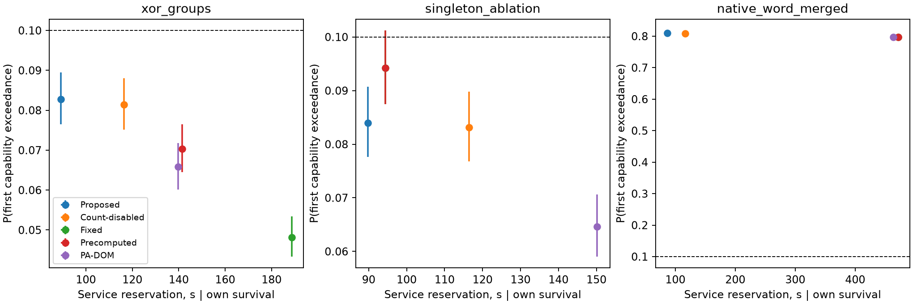
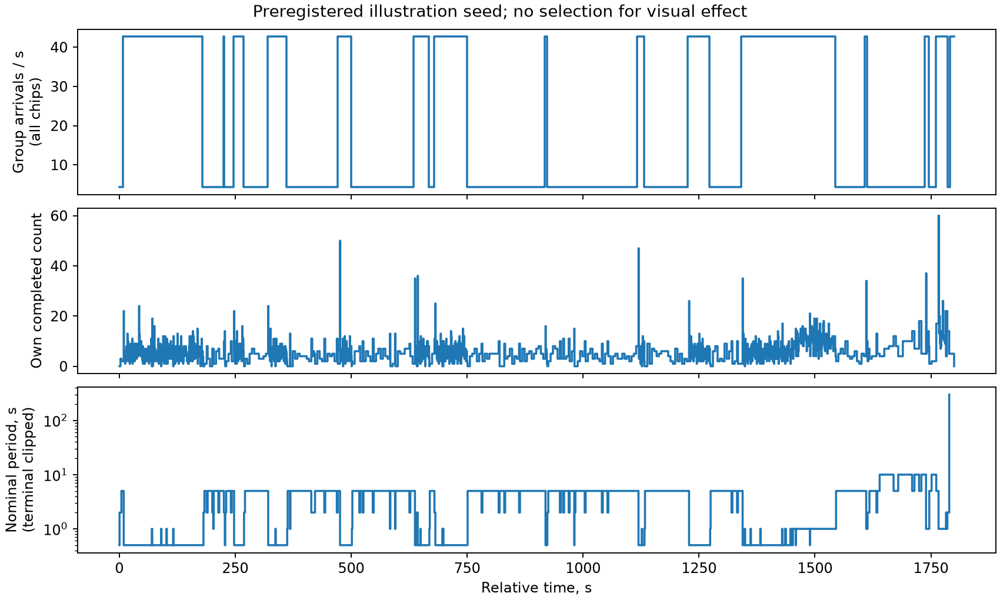

# ISSI-GROUPED-VALIDATION — законченный смешанный результат

**Итог B: полезность собственного count подтверждается в основной объявленной модели, но перенос инженерного решения зависит от реконструкции групп и выбора простого режима.** Это собственный расчётный результат, ещё не Scientific Review/acceptance.

В основном XOR-групповом сценарии Proposed имеет F̂=**0.08280**, одновременный биномиальный интервал **[0.07648; 0.08944]**, а Count-disabled — **0.08145 [0.07518; 0.08804]**. Обе верхние границы ниже исследовательского ε=0.1. На общей surviving-подвыборке J=17832 собственный count сокращает резервирование обслуживающего интерфейса на **23.36% [23.11%; 23.61%]**, или **27.20 с [26.91; 27.50]** за 1800 с. Парная разность рисков **+0.00135 [−0.00662; +0.00932]**: равенство рисков не доказано.

Против выбранного Precomputed выигрыш обслуживания — **36.94% [36.73%; 37.14%]**, но риск выше на **0.01245 [0.00533; 0.01955]**. Это использование части допустимого риска ради ресурса, не Pareto-доминирование. Цена — **2.655 MiB** таблиц в отдельной защищённой памяти, рабочее состояние и вычисление на каждом завершённом проходе. Для оправдания на конкретном исполнителе эта цена должна укладываться в приведённый ниже break-even и временной контракт; полный net-cost выигрыш физического устройства не установлен.

Две границы вывода существенны. В singleton-контроле преимущество перед настроенным Fixed=1 с составляет лишь **4.96% [4.65%; 5.28%]**, ниже заранее выбранных 10%. При объединении девяти исходных двухбитных нативных слов в атомарные шаблоны риск Proposed становится **0.80915 [0.79980; 0.81826]**; все пять политик нарушают ε. Поэтому результат нельзя переносить на ISSI как физическую гарантию или объяснять одной гистограммой singleton-интенсивности. Условная экономия среди немногочисленных survivors последнего случая не делает его допустимым.

## 1. Постановка и происхождение

Уточняющий handoff разрешил эмпирический grouped-model опыт и снял требование предварительно доказать полный физический перенос. Исторические BLOCKED_INPUT-пакеты 44b3d599… и 268e0d77… сохранены, не переписаны. Main/DEC/RES/Issue15/рукописи не менялись. Новая область — только continuation-02.

| Параметр | Значение | Статус/основание |
|---|---|---|
| Память | 3 × ISSI IS61WV204816BLL, 2^21×16 на чип, nominal 3.3 V | SOURCE: архив и datasheet Rev A3, идентичность в continuation-01/sources.json |
| Активный буфер | W=524288; useful 2 MiB; protected 39W=2.4375 MiB | Условие расчётной архитектуры: 2 MiB read-only рабочий буфер |
| Размещение | chip0/1: 16+16 data; chip2: 7 parity; общие адреса | ASSUMPTION; padding9W=.5625 MiB, inactive9 MiB; всего установлено12 MiB |
| Полный код | внешний SECDED(39,32), счётчик всех исправленных service-слов | Проверенный код предыдущего пакета; systematic permutation; не внутренний ECC ISSI |
| Источник | 60 static 14-MeV neutron tests; 55353 bits; 44364 XOR groups | SOURCE: raw+35 offsets; все60 авторских group logs совпали |
| Экспозиция | 3119.5 с; 1.931363773051828e11 n/cm² | SOURCE workbook; нет подмены irradiation duration временем чтения |
| Высокий масштаб | 6.19126069e7 n/(cm²·s); 14.22150986 groups/(chip·s) | INFERENCE: pooled fluence/time и reconstructed groups/time; не истинные particle labels |
| Защищённая интенсивность | bH=10.8128656435, bL=1.08128656435 с⁻¹ на 39W | Вывод первого момента; множитель39/64 однократный; low/high=0.1 — условие модуляции |
| Временной закон | symmetric CTMC, D=60 с, μ0=(.5,.5), одинаковые marks в режимах | ASSUMPTION: controlled beam model, не оценка CTMC по разрывам между тестами |
| Горизонт/требование | H=1800 с; ε=.1 | Исследовательский проектный уровень, не mission allocation |
| Проход | слот200 нс; P=.1048576 с; latch→commit80 нс | Расчётный исполнитель, не board WCET; 100 нс/слот service reservation |
| Действия/резерв | U=[.2,.5,1,2,5,10,20,30,60,100,150,300] с; backup=.5 с | Зафиксированы до tuning/test |
| Начало/нагрузка | чистый массив/no pending; backlogged application reads, без writeback | Численное начальное условие; application исправления не входят в scrub-tagged count |

Архив SHA256 **7c4e05968a8e0adc9733a3ba706a8ed2f751e53162b80b9746c1b8c4ccdb2e88**, MD5 и member hashes — в inputs/manifest.json. Данные [Franco et al., DOI10.5281/zenodo.17500462](https://doi.org/10.5281/zenodo.17500462), EUPL-1.2; авторы, метаданные и лицензия сохранены. Raw ZIP не дублируется в Git; существенные derived templates и test records опубликованы.

Каждый эмпирический шаблон получает общий uniform XOR address shift и общий lane shift, затем обрезается по активной области/padding. Сохраняется зависимость внутри группы; absolute hotspots намеренно не повторяются. Копии чипов условно независимы при общей CTMC. Равная чувствительность data/parity, однородность и использование конечной mismatch mask как атомарного toggle — условия модели, не измеренные факты. Эмпирический максимум23 не является физическим пределом. Полная семантика исполнения и границы регистрации — MODEL_AND_COST.md.

## 2. Численная основа и план

Принятые controller core/decision/observation/PA-DOM helpers не переписаны. Пересчитаны параметры и таблицы; compound-count фильтра нет. Reference backup potential=**0.06114977424118347**, delta=**0.00033146425961188614**, initial slack=**0.03851876149920464**. Более свободный SR arithmetic total=**0.0000915506931228335** покрывается новым reserve=.0003. Исторический более тесный tally не используется вместо SR. Абсолютная поддержка/масса таблиц проверены; min positive entry≈2.4182e−165. Условие exp/expm1≤4ulp остаётся объявленным вычислительным контрактом, не доказанным WCET/сертификатом произвольной платформы.

Это reference для uniform singleton/instantaneous модели, а не whole-horizon сертификат grouped/delayed исполнителя. Model mismatch не оплачен прежним delta. Удвоенная квадратура изменила начальный потенциал примерно на 3.57e−12; это диагностическая проверка, не замена априорной оценки.

Preregistration опубликована **c09928f2ad0e483539426ec2c0d20e84adbb3d86**. По 2000 tuning streams/case, все12 Fixed +144 Precomputed +36 PA-DOM; затем отдельный pre-test commit **8ed0035d8b75b43733d9dcce4473835031d21f49**. Test: ровно20000 независимых потоков/случай, каждый подан всем5 политикам; всего60000 потоков/300000 policy executions. Seeds и правила полностью в config/PREREGISTRATION. Один исключённый debug stream раскрыт; test не использовался для перенастройки.

Семейство: alpha_each=.05/54. Биномиальные интервалы — exact Clopper–Pearson; парная разность риска — консервативный rectangle для discordant probabilities. Ресурсные интервалы — парные Student/CLT delta, **асимптотические** с той же Bonferroni allocation. Поэтому общая комбинированная 95%-семейная процедура не объявляется точной finite-sample гарантией. Nominal95% и one-sided95% bounds также сохранены отдельно в CSV. J условен на совместное survival; own-survivor means имеют другие условные популяции.

## 3. Основная журнальная таблица: XOR-группы

Интервалы F ниже — family-adjusted. Средние проходов/ресурса — на собственных surviving missions, не безусловная экономия.

| Политика / настройка | E_cap / 20000 | F̂ [интервал] | Полных проходов | Service reservation, с | Online цена |
|---|---:|---|---:|---:|---|
| Proposed | 1656 | .08280 [.07648;.08944] | 1703.39 | 89.307 | q, таблицы, own-count update |
| Count-disabled | 1629 | .08145 [.07518;.08804] | 2221.00 | 116.444 | та же конструкция, marginal update |
| Fixed=.5 с | 964 | .04820 [.04333;.05342] | 3600.00 | 188.744 | один период |
| Precomputed=.5/1 с | 1407 | .07035 [.06450;.07653] | 2700.00 | 141.558 | два периода+время |
| PA-DOM Ms=.05, cap5, growth3, zero1 | 1316 | .06580 [.06013;.07180] | 2666.70 | 139.812 | скалярная история/арифметика |

Все5 подтверждают общее требование в заданном генераторе. PA-DOM — конкретная accepted target adaptation формул Красникова с ограничением на U, не буквальная репликация исходной системы и не оптимум всех reactive policies.

| Proposed против | J | ΔF [интервал] | G_J [интервал], % | Освобождено service, с |
|---|---:|---|---|---:|
| Count-disabled | 17832 | +.00135 [−.00662;+.00932] | 23.36 [23.11;23.61] | 27.20 |
| Fixed | 18344 | +.03460 [+.02983;+.03935] | 52.68 [52.53;52.84] | 99.44 |
| Precomputed | 18044 | +.01245 [+.00533;+.01955] | 36.94 [36.73;37.14] | 52.29 |
| PA-DOM | 17902 | +.01700 [+.00850;+.02548] | 36.10 [36.03;36.17] | 50.42 |

**Защита от завышения силы Fixed:** выбранные .5 с — результат заранее заданной conservative tuning procedure, не доказанный class optimum. Fixed=1 с на tuning имел186/2000, F̂=.093, upper95=.10438: он **не исключён как недопустимый**, а не прошёл правило отбора. Поэтому 52.68% нельзя выдавать за выигрыш над минимально возможной ценой постоянного режима. Пересечение этой tuning-границы и различие выбора Fixed в singleton-контроле — существенное ограничение инженерного вывода, не скрытая победа адаптации. Не запускался post-test подбор более выгодного comparator.

## 4. Ресурсный смысл и цена

Основной Proposed среди собственных survivors: ≈8.93066e8 полных service-read транзакций, ≈10670.8 acknowledged corrective writes, **17.8615 с** фактически занятых read/write циклов; reservation89.3066 с включает decode/guard/ack. Stop-reservation mean=86.7335 с; эта меньшая величина не считается выигрышем от раннего E_cap. CSV содержит и остальные stop/survival/partial показатели.

Против Precomputed на общем J освобождается **52.2884 с** интерфейсного резерва, то есть **2.9049 процентного пункта** доступной прикладной ёмкости за1800 с. Нижняя ресурсная граница51.9975 с соответствует примерно **30.54 мс дополнительной цены на Proposed-update** при наблюдаемом среднем числе updates (это отношение к описательному знаменателю, не отдельная confidence bound для отношения). Относительно count-disabled аналогичный allowance≈15.81 мс/update. Кроме break-even нужно уложиться в минимальный idle deadline **95.1424 мс**, не сдвигая проверку слова.

Цена размещения: 2,784,048 bytes таблиц/packed arrays≈**2.655 MiB**, q208 bytes плюс скаляры/runtime; таблицы больше полезных2 MiB данного буфера. На обновление dense observation —676 multiply-add pairs и5408 bytes коэффициентов, плюс до12 affine action evaluations. Предполагается отдельное защищённое control storage; его надёжность не покрыта E_cap буфера. На host 10000 observe+choose calls заняли≈.0599 с (~5.99µs/call), **не WCET** и не полный аппаратный бюджет. Fixed/Precomputed обходятся скалярным состоянием. Возможность precompute deterministic count-disabled не использована и не скрыта.

Следовательно инженерный ответ **условный, но проверяемый**: при наличии такого control storage и соблюдении break-even/deadline собственный count высвобождает измеренный actuation resource относительно выбранных конкурентов. Без этих ресурсов, либо против действительно достаточного более редкого Fixed, полная цена адаптации может не оправдаться. Снижение энергии, общей стоимости платы или квалифицированный flight benefit не заявляются.

## 5. Дополнительные случаи — не подмена основного

| Случай | Proposed F̂ [family CI] | Count-disabled F̂ | Fixed / Precomputed F̂ | PA-DOM F̂ | Вывод |
|---|---|---:|---:|---:|---|
| Singleton ablation | .08400 [.07764;.09068] | .08315 | .09420 / .09420 | .06465 | Own-count gain22.95% [22.70;23.20], но против Fixed1 с только4.96% [4.65;5.28] |
| Native-word merged | .80915 [.79980;.81826] | .80880 | .79705 / .79705 | .79715 | Все нарушаютε; условная экономия не спасает требование |

Singleton Fixed/Precomputed выбраны1/1 с; их family interval [.08749;.10122] пересекаетε: результат требования **не разрешён**, не доказана недопустимость. PA-DOM настройка совпала с main. В merged выбран наиболее благоприятный по tuning upper Fixed=.2 с / Precomputed=.2/.2; PA-DOM Ms=.05,cap5,growth2,zero0, но tuning уже не имел допустимого кандидата. Полные интервалы всех15 policy rows и12 pairs сохранены в CSV/JSON, включая неблагоприятные.

Основной и merged варианты сохраняют одни и те же raw mismatch masks и девять double-word occurrences, но **различают родительскую реконструкцию и опубликованную XOR-гистограмму** (44364 против44355 групп). Они не заявлены эквивалентными по всем наблюдениям архива. Это конструктивная чувствительность решения, не универсальная теорема неидентифицируемости и не доказательство истинности одной из группировок. Данные не подтверждают отсутствие physical MBU только потому, что XOR offsets кратны16.

## 6. Неопределённость входа

2000 whole-test bootstrap resamples дают95%-диапазон bH **[10.68698;10.94567] с⁻¹**, отдельно от MC CI. Единица ресемплирования — один из60 тестов, не бит/группа. Общая калибровочная ошибка и межчиповая вариабельность не учтены; обменность тестов — допущение.

В merged-модели консервативный direct-path диагностический lower≈**.70843** (см. вывод в MODEL_AND_COST.md). Его bootstrap диапазон [.42375;.86870]; дополнительная Poisson-count sensitivity нижнего масштаба9 double-word templates даёт lower≈.43324. Это показывает, что отрицательный исход данной реконструкции не объясняется одной узкой MC-погрешностью или небольшим колебанием числа тестов. **Это не физическая lower bound для ISSI.** Полный nested policy bootstrap не выполнялся; положительное main-решение остаётся условным на фиксированном отклике и реконструкции, не робастным ко всей физической неопределённости.

## 7. Проверки, воспроизведение и поставка

- Все60 raw-to-group проверок совпали; пустой treated CSV восстановлен из raw941 bits; исправленные counts не взяты из ошибочной summary workbook.
- 8 прежних full-word regression tests и12 новых unit tests пройдены; в новом oracle100 фиксированных случайных потоков плюс latch/commit/atomic/terminal fixtures. Намеренно ошибочные mapping/rate/parity варианты отвергнуты.
- 100 независимых action-expression comparisons,2000 posterior checks; block-moment ODE max scaled difference3.66e−11. Генераторные diagnostics/immutability пройдены.
- Все18000 выбранных tuning policy records повторены final executor, максимальное отличие0;6000 stream hashes совпали.
- Test: **0 computational failures** из300000 policy executions. Малые likelihood не заменялись fallback; cap32 сохранён.
- Независимый checker восстановил199 статистических величин из опубликованных trial rows,0 ошибок; zero-event upper sentinel ненулевой. Compileall exit0.
- Tuning≈1096 с; test≈419 с на6 workers. Наблюдённая совокупная RSS≈1.55 GB tuning /1.13 GB test — снимки, не доказанный peak. Полное повторение каждого test stream второй независимой реализацией не заявляется: независимый word oracle малый, final statistics полные.

Команды/окружение/схема records — REPRODUCE.md. Три test archives (~9.1 MB суммарно), derived inputs, таблицы и рисунки доступны в Git. Большие development caches имеют hashes/regeneration, но не являются единственной опорой confirmatory результатов. Общие зависимости с oracle/checkers раскрыты; это инженерная проверка, не независимый Scientific Review.

Вертикальные интервалы family-adjusted, горизонтальные own-survivor nominal95%; совпавшие Fixed/Precomputed точки перекрываются. Разные own-survival популяции не заменяют парное сравнение.

Seed2026091606, main trial0: E_cap не наступил,1417 completed passes. Истинный rate показан только читателю, не контроллеру. Последний nominal300 s обрезается горизонтом; это не300 s добавленной экспозиции. Пара одинаковых counts из принятого RES-003 не переотбиралась.

## 8. Максимальная формулировка для статьи

«В заданной модели групповых инверсий, реконструированной из статических14-MeV нейтронных данных ISSI, использование собственного счётчика уменьшило условный резерв обслуживания на23.36% относительно count-disabled при подтверждённом для обеих политик исследовательском уровне риска0.1. Относительно заранее настроенных простых политик получен компромисс риск–ресурс с явной ценой контроллера. Преимущество над оптимальным Fixed и физическая гарантия SRAM не установлены; альтернативное объединение зарегистрированных двухбитных слов изменило решение на нарушение требования всеми рассмотренными политиками».

Следующий шаг — решение Orchestrator о допустимом использовании и отдельный Scientific Review. Не назначены новый RES/PASS, hardware implementation, новый physical bridge или автоматическая серия repairs.
