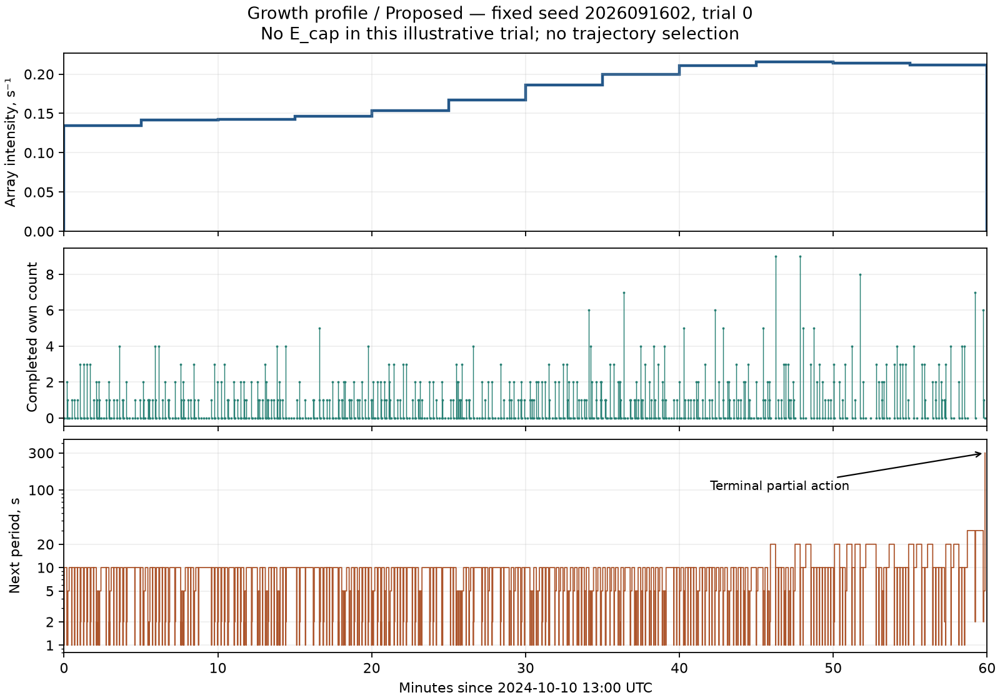

# GOES-16: проверка управления по собственному счётчику

Статус: OWN RESULT, инженерная поставка для отдельного Scientific Review и
disposition Orchestrator; не новый RES и не самостоятельно назначенный PASS.
База 7b83f643efb37541547d7d93a65ba2f43acd43fd.
Предварительная фиксация опубликована отдельным коммитом
870a3c5d725793dd45ff2cc2feaf6e8885df0df9 до первого прогона политик.

## 1. Научный ответ

На основном профиле роста собственный счётчик сохраняет содержательную
управляющую ценность относительно того же метода без показаний: число проходов
на общей surviving-подвыборке сокращается на **75.17%**, одновременный интервал
**[74.48%; 75.85%]**. Одновременно установлен рост риска: **+0.105 процентного
пункта**, одновременный интервал **[+0.0139; +0.1964] п.п.** Это подтверждённый
компромисс риск–ресурс при выполнении общего исследовательского требования .1,
а не одинаковый риск.

Однако на всех трёх профилях уже сертифицируется Fixed=300 с — самый редкий
разрешённый постоянный режим, всего 12 полных проходов за час. Поэтому опыт
не устанавливает необходимость сложного управления, его оптимальность по GOES
или преимущество перед достаточно редким простым режимом. Он показывает
последствие использования собственного наблюдения в замороженной конструкции.
На росте и пике Proposed также заметно затратнее выбранной PA-DOM adaptation.
Этот отрицательный для универсального доминирования результат включён в вывод.

## 2. Вход, происхождение и область применимости

SOURCE: пять официальных G16 SEISS/SGPS L2 avg5m v3-0-2 файлов за
8–12 октября 2024. [NOAA/NCEI продукт](https://www.ncei.noaa.gov/products/goes-r-space-environment-in-situ);
[каталог](https://data.ngdc.noaa.gov/platforms/solar-space-observing-satellites/goes/goes16/l2/data/sgps-l2-avg5m/2024/10/).
[Внешний каталог события](https://www.ngdc.noaa.gov/stp/space-weather/interplanetary-data/solar-proton-events/SEP%20page%20code.html)
мотивирует календарный участок до сравнения политик. Точные URL, SHA256,
версии и время извлечения — input_manifest.json, временные ряды — derived_rates.csv.

1440/1440 пятиминутных интервалов пригодны по зафиксированному контракту;
исключённых интервалов нет, в том числе около события. Это полнота пригодных
архивных средних, не заявление о полном числе первичных секундных измерений:
8 октября минимальная заполненность отдельного канала 25 из 300,
9–12 октября минимум 300. Все ignored-DQF маски нулевые. Положительные
неполные средние сохранены и маркированы в input_quality.csv.
Разрывов/временной интерполяции/сжатия нет. 1429 полных часовых окон.

| Случай | UTC начало | UTC конец | Интеграл nu, ожидаемые поступления | Последние минус первые 1800 с |
|---|---|---|---:|---:|
| Рост, основной | 2024-10-10 13:00 | 14:00 | 636.97015 | 105.68193 |
| Высокая экспозиция | 2024-10-10 14:45 | 15:45 | 884.29770 | 79.95755 |
| Типичный | 2024-10-08 13:05 | 14:05 | 2.97127 | -0.15721 |

Окна различны; выбор по экспозиции с ранним UTC при равенстве/нижней медианой
независимо перепроверен. Основной случай имеет положительный рост. Это три
отдельных опыта с чистым началом, не пятидневная миссия и не случайная выборка
всех условий эксплуатации. Историческая непросмотренность периода не заявлена.

ASSUMPTION: архивное среднее постоянно в своём 300-секундном интервале;
поступления — одиночные пуассоновские инверсии с независимыми равномерными
word/bit marks. Неизвестные внутрибиновые всплески вне области.

G16 проверен непосредственно: platform, версия, единицы, start-of-average
UTC timestamps, yaw=0, E/W и их собственные energy bounds. Использованы
Avg*Flux с архивной температурной поправкой, не Avg*FluxObserved.
Специфическая поправка GOES-19 не перенесена. P11 — интегральный >500 MeV;
13 остальных каналов — дифференциальные, перевод keV→MeV умножением на 1000.
Один множитель 4pi задаёт isotropy-equivalent реконструкцию каждого компонента.
lambda_bit имеет размерность s^-1 на бит; nu=524288*32*(lambda_E+lambda_W)/2.
Повторного множителя числа бит или 3600 нет.

Номинальный отклик — исходный main_loglog, 3 mm Al-equivalent, RADAR
b032505d4d1b15403b8ad06aef578339f6d1c6b4, неизменные экспериментальные точки
sigma_bit_experimental.csv. Масштаб=1, без подгонки к исходам.
Сохранены gamma=2 ниже P1, высокоэнергетический P10/P11 bridge и постоянная
sigma выше 186 MeV. Численный транспорт заканчивается на 390 MeV, хотя
native G16 P10 заканчивается на 404 MeV; диапазон 390–500 включён один раз
унаследованной моделью bridge, а не объявлен измеренным спектром.
Ретроспективный median-gamma fallback: E34, W135 интервалов, флаги построчно.
Никакие реконструированные значения контроллеру не передаются.

UNKNOWN / limitation: абсолютная физическая калибровка и точность отклика
не установлены. Сохраняется PARTIAL_SIGMA_EXTRAPOLATION, отсутствие экстраполяции
неупругой ядерной поправки выше поддержки TENDL и оговорки исходного пакета.
[Старый G16 provisional readme](https://data.ngdc.noaa.gov/platforms/solar-space-observing-satellites/goes/goes16/l1b/docs/GOES-16_SEISS_SGPS_L1b_Provisional_Maturity_ReadMe.pdf)
предупреждает о P5/P7, фоне и geometric factors. Из наличия L2 v3.2 мы не
выводим устранение всех этих физических проблем. Здесь проверяется поведение
на объявленной as-archived реконструкции, не готовность памяти/миссии.
Старые 43824 часовых значения и 148 заполненных часов используются только как
контекст; их обработка/геометрия не смешаны с новым входом.

## 3. Что сравнивалось и как считалась неопределённость

Все параметры контроллера из handoff и config.json заморожены: D=300 с,
H=3600 с, R2-U P=.18874368 с, W=524288, n=32, epsilon=.1, исходные действия,
q0, резерв, Kmax/Ccap/tick и квадратуры. Воспроизведены
q0 V_H=.07645559141483578, delta=.00021960410931119292,
floor=.07667519552414698, s0=.023324804475853028.
Арифметическое основание — принятый SR .000143018263177913 < .0002,
не историческая более выгодная оценка. Гарантия RES-003 остаётся CTMC-гарантией;
на GOES её не переносим.

Proposed и Count-disabled различаются только использованием завершённого
собственного count; второй применяет qP без его значения.
Fixed=1 с; Precomputed=2 с до 1800 с, затем 1 с по исходной границе начала
действия. PA-DOM=[4,2,2,.15,20,3,1], исходная выбранная адаптация, не буквальный
алгоритм Красникова и не весь его класс. Ни один параметр не обучался на GOES.

По 20000 реализаций в каждом окне; все пять политик получают одинаковые
заранее сгенерированные exogenous streams, но собственные counts.
Проверки слов последовательные, ошибки во время прохода сохраняются,
глобального сброса в конце прохода нет. E_cap поглощается при первом появлении
двух различных ошибочных позиций. Физическое состояние/дата/интенсивность/
survival не поступают в интерфейс контроллера. Подробнее PREREGISTRATION.md.

Для каждого риска сохранены nominal pointwise CP95, one-sided upper95.
Основной семейный уровень не менее 95%: Bonferroni .05/12 на четыре показателя
в каждом из трёх случаев (оба риска, парная разность рисков, G_J).
Парная разность ограничена через два discordant CP-интервала; условные средние
и их отношение — консервативными empirical-Bernstein bounds, фиксированными до
production. Для каждого среднего используется фактический размер surviving/J,
для G — общее J. Эти интервалы не покрывают физическую/измерительную неопределённость.
PA-DOM/дополнительные средние имеют только pointwise95, не семейную гарантию.
Нулевые наблюдённые отказы не означают нулевой риск.

## 4. Риск и ресурс

Журнальная машинная таблица с nominal95: outputs/journal_table.csv.
Полная policy_summary.csv дополнительно содержит one-sided/family bounds,
survivors, интервалы проходов, stop-cost, операции/частичные операции и сбои.

| Случай | Политика | E_cap / 20000 | F_hat | Средние полные проходы при survival |
|---|---|---:|---:|---:|
| Рост | Proposed | 24 | .00120 | 731.227 |
| Рост | Count-disabled | 3 | .00015 | 2945 |
| Рост | Fixed | 2 | .00010 | 3600 |
| Рост | Precomputed | 2 | .00010 | 2700 |
| Рост | PA-DOM | 35 | .00175 | 182.610 |
| Пик | Proposed | 40 | .00200 | 847.553 |
| Пик | Count-disabled | 3 | .00015 | 2945 |
| Пик | Fixed | 2 | .00010 | 3600 |
| Пик | Precomputed | 5 | .00025 | 2700 |
| Пик | PA-DOM | 87 | .00435 | 182.238 |
| Типичный | Proposed | 0 | 0 | 313.983 |
| Типичный | Count-disabled | 0 | 0 | 2945 |
| Типичный | Fixed | 0 | 0 | 3600 |
| Типичный | Precomputed | 0 | 0 | 2700 |
| Типичный | PA-DOM | 0 | 0 | 348.325 |

Разные строки используют разные surviving-подвыборки; основной вывод ниже —
только по общей J. Полный проход соответствует 2097152 чтениям и стольким же
записям, busy=P. Частичный проход считает выполненные чередующиеся операции
чтение/запись по исходному R2-U. Stop-cost останавливается на первом E_cap или H
и не выдаётся за экономию. Например, на росте Proposed stop-mean=730.880 против
surviving-mean=731.227; это различные estimands. Полная аппаратная/экономическая
эффективность не оценивалась.

### Главная пара: Proposed минус Count-disabled

Все интервалы в этой таблице — из общей primary family; риск как вероятность,
эффект в процентах, разность риска в процентных пунктах.

| Случай | Общая J | Верх риска P / disabled | G_J, % [интервал] | Разность риска, п.п. [интервал] | Классификация |
|---|---:|---|---|---|---|
| Рост | 19976 | .002086 / .000606 | 75.171 [74.479;75.855] | +.105 [.01394;.19637] | Подтверждённый компромисс при общем требовании |
| Пик | 19960 | .003087 / .000606 | 71.221 [70.505;71.928] | +.185 [.07099;.29895] | Подтверждённый компромисс при общем требовании |
| Типичный | 20000 | .000309 / .000309 | 89.338 [88.737;89.933] | .000 [-.03433;.03433] | Подтверждённый ресурсный эффект; равенство рисков не установлено |

Здесь округлённые upper приведены не как новые точные bounds: точные значения
в CSV. Четыре paired cells [оба survival, только P E_cap, только disabled E_cap,
оба E_cap]: рост [19976,21,0,3], пик [19960,37,0,3], типичный [20000,0,0,0].
Риск .1 не нарушен по семейному критерию; G нижние границы выше .10.
На росте/пике положительный интервал разности требует сообщать цену по риску.
В типичном окне семейный upper .000308642 ненулевой.

### Дополнительная пара: Proposed / PA-DOM

Pointwise95, не включено в primary family:

| Случай | J | G_J [интервал] | Разность риска [интервал] |
|---|---:|---|---|
| Рост | 19960 | -3.0043 [-3.3176;-2.7257] | -.00055 [-.001309;.000218] |
| Пик | 19907 | -3.6507 [-4.0059;-3.3350] | -.00235 [-.003494;-.001192] |
| Типичный | 20000 | .09859 [.02884;.16295] | 0 [-.000219;.000219] |

На росте/пике Proposed требует примерно 4.00/4.65 раза больше проходов, чем
эта адаптация. На пике риск Proposed ниже; на росте его отличие не установлено.
Типичный профиль показывает положительное сокращение, но интервал пересекает
порог 10%; утверждать этот масштаб преимущества над PA-DOM нельзя.
Совместные surviving-подвыборки велики; ограничения точности даны интервалами.

## 5. Обязательная проверка Fixed=300 с

Coupling: любой E_cap между соседними проверками слова требует хотя бы пары
поступлений в разные биты этого слова в том же интервале. Ожидаемое число таких
пар при array exposure L равно (31/64)*(L/W)^2. Union bound по всем словам и
всем их реальным интервалам, включая начало и конец, даёт достаточную оценку.
Тогглы могут уменьшать реальный риск, но не нарушают включение.

Для слова j проверки в 300k-d_j, d_j=P*(W-1-j)/W. В первом интервале
L=r0*(300-d), внутри L=rprev*d+rnext*(300-d), в последнем L=r11*d.
Точная сумма через первые два момента d вычислена рационально на зафиксированных
binary64 rates/P; decimal округлён вверх. Независимый тест перечисляет все
524288 положений слов, не использует формулу моментов.

| Профиль | Достаточный upper F_A (округлён вверх здесь) | Решение |
|---|---:|---|
| Рост | .032204010 | <= .1, SUFFICIENT |
| Пик | .062912571 | <= .1, SUFFICIENT |
| Типичный | .000000683378 | <= .1, SUFFICIENT |

Грубый max-rate bound на пике .16231 был бы недостаточен; учёт фактических
интервалов даёт приведённый результат. Это не объявление пикового риска
равным .06291 и не post-hoc настройка пяти политик. Это отдельная обязательная
ретроспективная достаточность простого режима при известном профиле.
Она существенно ограничивает прикладной вывод даже при большом эффекте счётчика.

## 6. Причинная иллюстрация

Единственная заранее назначенная реализация seed=2026091602, trial=0:
737 полных проходов, E_cap не произошло; трасса содержит все завершённые counts,
не отобранные удачные моменты. Верхний профиль — внешний контекст рисунка,
он не доступен контроллеру. q_H не является физическим posterior при survival.
Полная трасса — outputs/growth_illustration.csv. Типичная иллюстрация оказалась
без поступлений; новый «удачный» seed не искался.

## 7. Проверки, отклонения и допустимая формулировка

11 предпусковых тестов без failures/errors: явный word-level oracle, 80 случайных
потоков x5 политик, граничные события, toggle/first passage/terminal, sentinel,
count-disabled, интерфейс/численные ошибки, генератор, статистика, выбор окон,
Fixed300 и исходный floor. Независимая свёртка 10 direction/rows:
максимальное относительное расхождение 6.66e-16; нормировка всех 1440 строк;
независимый выбор окон [732,753,157]. Общие зависимости раскрыты в HANDOFF.

Все 60000 hashes потоков перегенерируются; 60 policy-trial результатов
повторяются побитно. Это воспроизведение исходного кода, не независимый oracle.
Все production-таблицы пересобираются побайтно. Никаких удалённых trials,
недопустимых numerical updates или скрытых fallback не зарегистрировано.
Проверены 576 файлов базы: 551 совпадает с raw Git blobs; у 25 остальных
обнаружена только checkout-нормализация LF/CRLF (обе суммы сохранены).
Содержательных расхождений нет; ни один файл базы не включается в коммит.
Полный результат проверок, версия среды, время и память — outputs и REPRODUCE.

Технические отклонения: Windows требовал короткого JIT-кэша и process-local
core.longpaths=true. Первые три вызова production завершились на Git-проверке
до генерации какого-либо потока; после изменения только среды выполнен
зафиксированный объём. При отладке независимого checker и postprocessor
устранена повторная распаковка NPZ. Контроллер, статистические правила,
вход/окна/seed и preregistered execution code после фиксации не менялись.
Унаследованные ten CSV имеют Git-status CRLF false positives при byte-identical
содержимом; исходные файлы не «исправлялись» для чистого статуса. Эти десять
CSV не совпадают с перечисленными выше 25 checkout-нормализованными файлами.

Наибольшая допустимая формулировка после принятия: в трёх объявленных
GOES-derived часовых опытах замороженный RES-003 использует собственный count
для существенного сокращения проходов относительно своего count-disabled
варианта; на росте/пике — при установленном увеличении риска, остающегося ниже
исследовательского .1. На этих же профилях достаточно Fixed300, и преимущество
над простой политикой/PA-DOM в целом не установлено. Теорема RES-003,
физический bridge, вся диссертация и статус Issue15 этим не пересматриваются.
