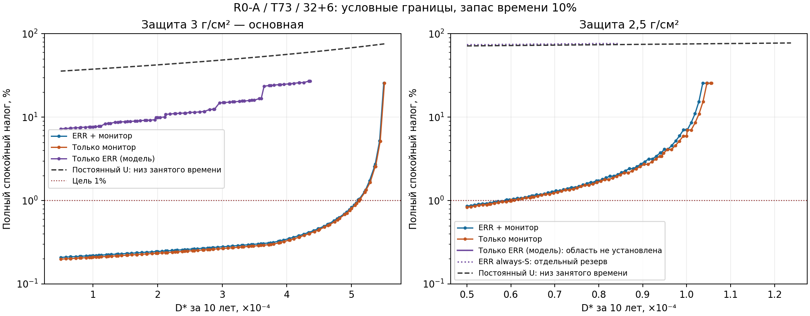
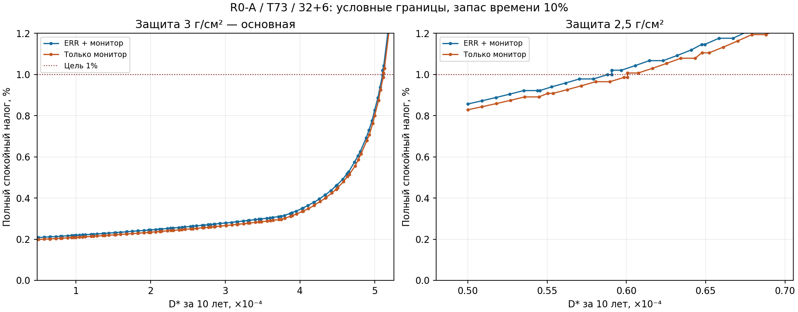

# T88. Чувствительность R0-A к прямому вкладу D*

Задание [#88](https://github.com/z3tm4n-x/phd-adaptive-memory-ecc/issues/88).
Главный пример — CY62167, внутренний 32+6, W=524288, ГСО, 10 лет,
ε=10⁻³. Основная защита 3 г/см²; 2,5 г/см² считается отдельно.
Все версии и границы поиска — в `config.json`, записанном до пилота.

**Поставка завершена численно:** [RESULTS.md](RESULTS.md),
[метод и единицы](METHOD.md), [шесть порогов](outputs/thresholds.csv),
[безопасная передача #89](outputs/handoff.json), [протокол](outputs/protocol.json).
Это условная инженерная проверка, не научная рецензия и не квалификация прибора.

Одна команда полного повтора из корня репозитория, без сети:

```bash
python -X utf8 -B experiments/t88-dstar-sensitivity/run.py --workers 2
```

Python ≥3.12; matplotlib 3.10.8 нужен только для PNG/SVG. Первичный полный
перебор занял около 14 минут на двух численных процессах. Команда выполняет
тесты, независимые проверки, таблицы, графики и отчёт; пишет только в T88.
`--resume` переиспользует промежуточные вычисления того же конфига.





## План численной проверки до полного прогона

D* — заданный условный верх E[N_D] для родителей, поражающих ≥2 позиции
хотя бы одного полного слова. Это не ERR, не число пар/слов и не сама
вероятность. D* не уменьшается при перенастройке. Поиск физических данных
и новые облучения не входят в задачу.

Переиспользуются принятые T80 (6a)/(9), Б.7 и T82. Исходный набор — только
T73; шесть квот по 10⁻⁶ сохраняются с удалением лишь неиспользуемых квот
по соответствующей формуле. Сервис 100 тактов, запас времени 10%,
пик ≤80% в 1 мс, задержка ≤3 мкс; параметры физической операции не меняются.
Канал combined/monitor-only фиксирован: aM=AM=10⁶, η=0,001 с⁻¹,
w=d=1 с, Δ=0,5 с. ERR-only использует отдельную singleton-область и (9).

Семейство: все допустимые целые g в конечном диапазоне короткого бюджета;
нечётные ka=1..4095; шесть прежних vc и два кандидата Б.11; шесть прежних z.
Удержания мониторных вариантов — прежние 1 с. Для ERR-only перебираются
десять принятых h и конечные интервальные мажоранты Е.3. ka=1/always-S
выводится отдельно от двухрежимного правила. Другое семейство правил,
новая теорема или широкий поиск не назначены.

Для каждой фиксированной параметризации риск имеет вид D*+R0.
Цена включает D*, риск за срок, начало, тихие интервалы, возвращения,
ложные флаги, потери, удержание, выход и оба краевых члена. Стоимость
считается до T, в том числе после скрытого отказа. Критерий — максимум
верхов whole-quiet и returning, TQ≥0,9T, KQ≤1000. Выбор лучшей допустимой
строки на каждом D* эквивалентен повторной перенастройке внутри семейства;
это не уменьшение direct и не двойной расход экспозиции.

Порог 1% и предел сертификата без 1% разделены. Точность скобок D* —
10⁻⁹, округление наружу; для #89 передаётся только проверенный нижний конец.
Без доказательства полноты вне этого семейства результат называется
«наибольшим найденным сертифицированным D*». При пустой области с D*≥5·10⁻⁵
порог не подменяется нулём. Непрохождение upper не исключает метод.
Для внутренней рабочей точки до выбора заявлен предлагаемый запас риска
5·10⁻⁵ (5% ε); он не становится новым обязательным требованием автора.

Постоянный U: полный целочисленный диапазон сертификата, M и M+1, тот же
сервис, без цены/квот монитора. Верх цены, нижняя фактическая занятость при
открытом occupied-контракте и необходимая граница класса — разные поля.

Первый шаг — короткий пилот и оценка времени. Перед полным прогоном план
публикуется в draft PR. Старые каталоги и выходы остаются неизменными.

## Пилот

```bash
python -X utf8 -B experiments/t88-dstar-sensitivity/pilot.py
```

Пилот 03.10 воспроизвёл исходные точки: returning-верх combined —
0,259672136% / 0,857038032% (3 / 2,5 г/см²); monitor-only —
0,245096103% / 0,828880735%; ERR-only — 7,432968207% / 76,434241107%.
Последняя строка при 2,5 относится к ka=1 и будет отделена как always-S.
Полный пилот занял около 28 с; мониторные строки — менее 0,3 с каждая,
ERR-only при 3 г/см² — около 24 с. Узкое место — интервальные мажоранты ERR.
Верхняя предварительная оценка полного расчёта — до двух часов на одном
процессе; фактическое время и число мажорант сохраняются в протоколе.
Расчёт параметризаций будет переиспользован по всей оси D*, а не повторён
для каждой её точки. Если потребуется сократить область, это будет отдельно
записано до такого прогона, без изменения уже полученных свидетельств.

Этот раздел сохраняет раннюю запись пилота. Итоги полного расчёта и
дополнительных проверок приведены выше и в RESULTS, старые выходы T82 не менялись.
