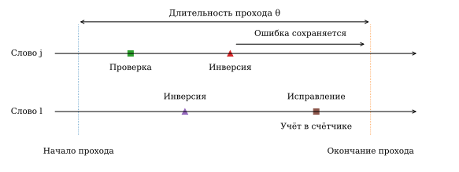
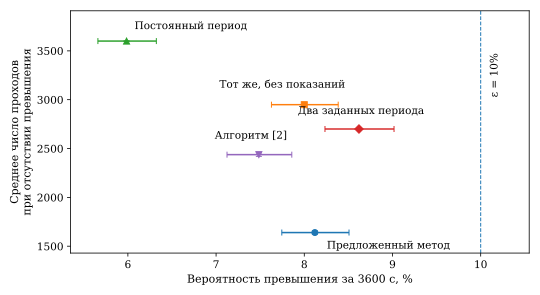

# Адаптивный выбор периода скраббинга памяти по счётчику исправлений

**Аннотация.** Предложен метод выбора периода скраббинга по счётчику исправлений, обеспечивающий ограничение вероятности превышения корректирующей способности за заданное время работы. Для модели одиночных сбоев с известным законом переключения интенсивности получено достаточное условие выбора периода без определения состояния каждого слова. Учитываются зависимость показаний от выполненных периодов и инверсии после проверки отдельных слов. В расчётах для массива из 524 288 слов использование счётчика уменьшило среднее число проходов по реализациям без превышения на 29,9–44,4% относительно того же управления без показаний. Сокращение относительно адаптированного алгоритма Красникова и соавторов составило 26,2–32,7% при общем ограничении вероятности. Метод позволяет уменьшать объём обращений к памяти, затрачиваемых на скраббинг.

**Ключевые слова:** статическая оперативная память, одиночный сбой, помехоустойчивое кодирование, скраббинг, адаптивное управление, счётчик исправлений.

## Введение

Одиночные сбои в памяти бортовой вычислительной системы вызывают искажение хранимых данных. Код с исправлением одной ошибки восстанавливает слово при повреждении одного разряда, однако две ошибки, накопившиеся до проверки, уже выходят за его гарантированную корректирующую способность. Для ограничения накопления применяют скраббинг — периодическое чтение памяти с проверкой, исправлением ошибок и обратной записью. Вероятностные оценки накопления при таком восстановлении рассмотрены, в частности, в [1].

Частые проверки уменьшают время накопления ошибок, но увеличивают число чтений и записей. Постоянный период, рассчитанный на повышенную интенсивность сбоев, сохраняет эти затраты и на спокойных участках. Поэтому возникает задача изменения периода по текущим условиям при заданном ограничении вероятности превышения корректирующей способности за всё время работы.

Источником информации может служить счётчик исправлений самой памяти. Красниковым, Лушниковым, Мещановым и соавторами предложен пересчёт периода регенерации по числу одиночных сбоев за предыдущий цикл для заданного допустимого числа многократных сбоев за время эксплуатации [2]. Chen и соавторы используют сведения об ошибках для прогнозирования интенсивности и изменения частоты проверок [3, 5]; отдельно рассмотрено управление по зарегистрированным ошибкам [4]. В патентах Cisco по ошибкам изменяются частота, пороги и длительность подсчёта [6, 7], в семействе Intel — период внутренних проверок и выбор адресов [8, 9].

Однако показание зависит от выбранного периода: он определяет время накопления и момент получения новой информации. Во время последовательного прохода ошибка может возникнуть в уже проверенном слове и сохраниться к окончанию прохода. Для следующего решения существенны и исправления, и ошибки, ещё не попавшие в счётчик. В [2] регулируется число многократных сбоев, а в [3, 5] вероятностная оценка относится к размещению ошибок внутри одного цикла. Для ограничения вероятности превышения за всю последовательность проверок требуется связать показания и состояние памяти с выбранными периодами. Такое описание необходимо и при использовании общих методов управления с частичной наблюдаемостью [10].

Цель работы — разработать метод выбора периода по собственному счётчику, обеспечивающий вероятностное требование за весь интервал без определения состояния каждого слова. Отличие метода состоит в совместном учёте зависимости показаний от выполненных периодов и инверсий после проверки слов. Для скрытой двухрежимной среды с известными параметрами получено достаточное условие такого управления. Численно исследуются полезность показаний внутри метода и затраты относительно алгоритма [2].

## 1. Модель памяти и критерий выбора периода

Массив содержит $N$ кодовых слов с $n$ информационными разрядами. Код исправляет одну ошибку; проверочные разряды и схемы защиты считаются исправными. Одно воздействие инвертирует один равномерно выбранный разряд равномерно выбранного слова. Номера слов и разрядов выбираются независимо для разных воздействий и независимо от среды. Повторная инверсия того же разряда возвращает правильное значение. Рассматривается накопление одиночных сбоев, без многократных сбоев одного воздействия.

Обозначим через $t_{\mathrm{ош}}$ первый момент появления двух ошибочных разрядов хотя бы в одном слове. В начальный момент память исправна. Для длительности работы $T$ и закона управления $\pi$ требуется

$$
P_\pi(T)=\Pr_\pi\{t_{\mathrm{ош}}\le T\}\le\varepsilon,
\tag{1}
$$

где $\varepsilon$ — допустимая вероятность. Последующее исправление не отменяет уже возникшего превышения. Критерий относится к гарантированной корректирующей способности; последствия для системы зависят от декодера и обработки данных.

Интенсивность инверсий на весь массив принимает два значения $\lambda_0<\lambda_1$. Режим среды $Z(t)\in\{0,1\}$ представляет собой непрерывную марковскую цепь. Среднее время пребывания в каждом режиме равно $D$, поэтому матрица интенсивностей переходов имеет вид

$$
G=\begin{pmatrix}-D^{-1}&D^{-1}\\D^{-1}&-D^{-1}\end{pmatrix},
\qquad \Pr\{Z(0)=0\}=\Pr\{Z(0)=1\}=\frac{1}{2}.
\tag{2}
$$

При заданной траектории $Z(t)$ инверсии образуют пуассоновский поток интенсивности $\lambda_{Z(t)}$. Контроллер знает $D$, $\lambda_0$, $\lambda_1$, но не текущий режим. Начальная смесь стационарна: рассматривается переключающаяся интенсивность при стационарном законе среды. Общая среда создаёт зависимость между потоками инверсий разных слов.

Полный проход по массиву длится $\theta$. В момент его окончания $t_i$ выбирается период $\tau_i$ до окончания следующего прохода, $t_{i+1}=t_i+\tau_i$; $t_0=0$ соответствует началу работы. Слова проверяются в порядке $j=1,\ldots,N$. Момент проверки слова $j$ равен

$$
t_{i,j}=t_i+\tau_i-\theta+\frac{j\theta}{N}.
\tag{3}
$$

Период выбирается из конечного множества $\mathcal U$, $\tau\ge\theta$. До начала прохода проверок нет; другие исправляющие обращения и перезаписи исключены. В момент $T$ дополнительное восстановление не выполняется. Последний неполный проход учитывается по фактическим проверкам, без нового показания за полный проход.

После прохода доступен счётчик $C_{i+1}$ — число одиночных исправлений в нём. До первого превышения он работает точно и без задержки. Контроллер использует только показания, время и свои периоды. Инверсия после проверки слова остаётся неучтённой к следующему решению (рис. 1).

{width=15.5cm}

Рис. 1. Учёт инверсий при последовательном проходе. В слове $j$ ошибка возникает после проверки и остаётся к концу прохода; в проверяемом позднее слове $l>j$ ошибка исправляется и учитывается счётчиком. Шкала времени условная.

Затраты характеризуются условным средним $J_\pi=\mathbb E[M_\pi\mid S_\pi]$, где $M_\pi$ — число завершённых проходов, $S_\pi=\{t_{\mathrm{ош}}>T\}$. Затраты сравниваются за полный интервал работы при отсутствии превышения. Требуется уменьшать $J_\pi$ при выполнении (1).

## 2. Метод управления по счётчику

### 2.1. Порядок работы контроллера

До начала работы выбирается постоянный резервный период $\tau_{\mathrm{р}}\in\mathcal U$ с оценкой вероятности ниже допустимой. Неиспользованная часть допустимой вероятности после учёта погрешностей образует запас для увеличения периодов. После каждого прохода контроллер уточняет распределение режима среды и числа инверсий после последних проверок слов. Каждый разрешённый период оценивается вместе с последующим использованием резервного периода. Выбирается наибольший вариант, увеличение оценки для которого укладывается в выделенную часть запаса. Получив новое показание, контроллер повторяет расчёт. Он хранит распределение небольшой размерности и запас вместо состояния всех слов.

### 2.2. Вероятностное описание показаний

Введём вспомогательную модель учёта инверсий. Каждая инверсия отмечается в соответствующем слове, а при проверке слова все накопленные отметки включаются во вспомогательный счётчик и удаляются. В этой модели две инверсии одного разряда учитываются как две отметки. Обозначим через $C_i^{\ast}$ вспомогательный счётчик, а через $K_i$ — общее число отметок, оставшихся к моменту $t_i$ после последних проверок слов. Далее $K_i$ называется остатком.

Следующий счётчик включает прежний остаток, инверсии за ожидание и инверсии в ещё не проверенных словах во время прохода. Инверсии в уже проверенных словах образуют новый остаток. Через $\xi$ секунд от начала прохода доля проверенных слов равна $f(\xi)=\lfloor N\xi/\theta\rfloor/N$. Потоки в счётчик и остаток имеют интенсивности $\lambda_{Z(t)}[1-f(\xi)]$ и $\lambda_{Z(t)}f(\xi)$. При заданной траектории среды они независимы; после усреднения по среде счётчик, остаток и конечный режим зависимы.

Для каждого периода $\tau$ заранее рассчитываются вероятности совместного получения показания $c$ и перехода из состояния $(z,k)$ в $(z',k')$. Они образуют матрицу

$$
\begin{aligned}
A_{\tau,c}[(z,k),(z',k')]={}&\Pr\{C_{i+1}^{\ast}=c,\,Z(t_i+\tau)=z',\,K_{i+1}=k'\mid\,\\
&Z(t_i)=z,K_i=k\}.
\end{aligned}
\tag{4}
$$

Здесь $z,z'\in\{0,1\}$; $k,k',c$ — неотрицательные целые числа. Матрица $A_\tau=\sum_c A_{\tau,c}$ описывает переход без конкретного показания. Её расчёт по закону среды дан в приложении.

Пусть вектор-строка $p_i$ содержит вероятности состояний $(z,k)$ по всем предшествующим показаниям и периодам. Для нового показания $c$ формула условной вероятности даёт

$$
\ell_c=p_iA_{\tau_i,c}\mathbf{1},
\qquad p_{i+1}=\frac{p_iA_{\tau_i,c}}{\ell_c},
\tag{5}
$$

где $\mathbf{1}$ — столбец единиц, $\ell_c$ — вероятность показания $c$. Матрица соответствует выполненному периоду: одно и то же показание при разных периодах даёт различную информацию. Распределение $p_i$ относится к вспомогательным отметкам. Применение этого расчёта к счётчику памяти требует обоснования.

### 2.3. Оценка вероятности накопления ошибок

Свяжем память и вспомогательную модель одними временами инверсий, адресами, разрядами и проверками. Такое совместное построение называется сопряжением. Пусть $t_{\mathrm{п}}$ — первое повторное попадание в слово, ещё не проверенное после прежней инверсии. До него в каждом затронутом и ещё не проверенном слове находятся одна ошибка и одна отметка. Счётчики совпадают, а одинаковые показания приводят к одинаковым периодам. Превышение в памяти возможно лишь при повторном попадании, поэтому

$$
\{t_{\mathrm{ош}}\le T\}\subseteq\{t_{\mathrm{п}}\le T\}.
\tag{6}
$$

Повторная инверсия прежнего разряда устраняет ошибку, но также нарушает совпадение моделей. Учёт такого случая по (6) увеличивает верхнюю оценку и позволяет обойтись без номеров разрядов и слов.

Пусть в момент решения режим равен $z$, а остаток содержит $k$ отметок. За последующие $h$ секунд интегральная интенсивность составляет $\Lambda_h=\int_0^h\lambda_{Z(u)}\,du$; начало отсчёта здесь совмещено с моментом решения. Введём условные моменты $m_{1,z}(h)=\mathbb E[\Lambda_h\mid Z(0)=z]$ и $m_{2,z}(h)=\mathbb E[\Lambda_h^2\mid Z(0)=z]$.

До первого повторного попадания старые отметки принадлежат разным словам. Среднее число совпадающих по слову пар «старая отметка — новая инверсия» равно $k\,m_{1,z}(h)/N$. При заданной среде среднее число неупорядоченных пар новых инверсий равно $\Lambda_h^2/2$; вероятность совпадения их слов — $1/N$. Вероятность появления хотя бы одной пары не превышает математического ожидания числа пар. Следовательно, вероятность первого повторного попадания на интервале не больше

$$
r_h(z,k)=\frac{k\,m_{1,z}(h)+\tfrac{1}{2}m_{2,z}(h)}{N}.
\tag{7}
$$

Проверки устраняют часть совпадений, поэтому подсчёт всех пар даёт верхнюю оценку. Она не требует положения старых отметок: новое слово выбирается независимо и равномерно. Марковское свойство сохраняет закон будущей среды при заданном текущем режиме и в моменты решений по прошлым показаниям. Явные моменты приведены в приложении.

### 2.4. Условие выбора периода

Пусть $R=T-t_i$ — оставшееся время. Обозначим через $v_R(z,k)$ ожидаемую сумму оценок (7) при использовании резервного периода $\tau_{\mathrm{р}}$ до конца работы. Запишем $v_R$ и $r_h$ как столбцы по состояниям $(z,k)$. Тогда

$$
v_0=0,\qquad
v_R=\begin{cases}
r_R,&0<R<\tau_{\mathrm{р}},\\
r_{\tau_{\mathrm{р}}}+A_{\tau_{\mathrm{р}}}v_{R-\tau_{\mathrm{р}}},&R\ge\tau_{\mathrm{р}}.
\end{cases}
\tag{8}
$$

Первое слагаемое учитывает ближайший интервал, второе — последующее использование резерва. Неполный последний интервал учитывается через $r_R$.

Конечное приближение матриц и округление вносят погрешность. Обозначим её общую верхнюю границу за время $T$ через $\delta$. Далее матрицы и распределения относятся к вычисляемой вспомогательной модели; при точном описании $\delta=0$. Для $p_0(0,0)=p_0(1,0)=1/2$ начальный запас равен

$$
s_0=\varepsilon-\delta-p_0v_T.
\tag{9}
$$

Условие $s_0\ge0$ проверяет допустимость резервного режима с учётом погрешности.

Для текущих $p$, $s$, $R$ оценим, как изменится ожидаемая сумма, если вместо ближайшего резервного периода выполнить $\tau$, а далее вернуться к резервному режиму:

$$
\Delta_\tau=\begin{cases}
p(r_\tau+A_\tau v_{R-\tau})-pv_R,&\tau\le R,\\
pr_R-pv_R,&\tau>R.
\end{cases}
\tag{10}
$$

При $\tau>R$ следующий проход не завершится за рассматриваемое время, поэтому будущего показания нет. На интервал длительности $h=\min(\tau,R)$ выделяется доля $h/R$ оставшегося запаса. Выбирается наибольший разрешённый период, для которого

$$
\Delta_\tau\le s\frac{h}{R},
\qquad s_{\mathrm{нов}}=s-\Delta_\tau.
\tag{11}
$$

После прохода применяется (5). Новый запас одинаков для всех возможных показаний выполненного прохода и неотрицателен в силу (11). Резервный период всегда допустим: по (8) для него $\Delta_{\tau_{\mathrm{р}}}=0$.

Покажем, что правило обеспечивает (1). Пусть $\mathcal I_i$ — история показаний и периодов к моменту $t_i$, а $R_i=T-t_i$ — оставшееся время. Величина $\Phi_i=p_iv_{R_i}+s_i$ объединяет ожидаемую резервную оценку и запас. Из (5) следует $\sum_c\ell_c p_{i+1}^{(c)}=p_iA_{\tau_i}$: усреднение по новому показанию возвращает распределение без его учёта. Подстановка (10), (11) даёт

$$
p_i r_{h_i}+\mathbb E_{\ast}[\Phi_{i+1}\mid\mathcal I_i]=\Phi_i,
\qquad h_i=\min(\tau_i,R_i).
\tag{12}
$$

Звёздочка обозначает усреднение во вспомогательной модели. В конце работы $v_0=0$, запас неотрицателен, а число решений конечно. Усредняя (12) последовательно, ограничиваем ожидаемую сумму $r_{h_i}$ величиной $p_0v_T+s_0=\varepsilon-\delta$.

Вероятность состояния при ещё сохраняющемся совпадении моделей не больше полной вероятности этого состояния во вспомогательной модели. Поэтому суммирование неотрицательных оценок (7) ограничивает вероятность первого расхождения, а по (6) — и превышения в памяти. С учётом погрешности получаем

$$
P_\pi(T)\le
\mathbb E_{\ast}\!\left[\sum_i r_{h_i}\bigl(Z(t_i),K_i\bigr)\right]+\delta
\le\varepsilon.
\tag{13}
$$

Условие (11) обеспечивает требование за весь интервал по совместному закону среды, инверсий и показаний. Оно позволяет увеличивать допустимый период; глобальный минимум затрат по всем законам управления не устанавливается.

## 3. Численное исследование

### 3.1. Условия расчёта и сравниваемые алгоритмы

Параметры приведены в табл. 1. Изменение известного $D$ меняет время сохранения режима при одинаковых стационарных вероятностях и средней интенсивности. Уровень $\varepsilon=0{,}1$ — параметр сравнительного исследования.

Таблица 1. Параметры численного исследования

| Параметр | Значение |
|---|---|
| Число слов $N$; информационных разрядов $n$ | 524 288; 32 |
| Интенсивности $\lambda_0$ и $\lambda_1$, с⁻¹ на массив | $2{,}8886786\cdot10^{-5}$; $6{,}1249308$ |
| Среднее время пребывания $D$, с | 30; 300; 3000 |
| Длительность работы $T$, с; допустимая вероятность $\varepsilon$ | 3600; 0,1 |
| Длительность прохода $\theta$, с; резервный период $\tau_{\mathrm{р}}$, с | 0,18874368; 1 |
| Разрешённые периоды $\mathcal U$, с | 0,2; 0,5; 1; 2; 5; 10; 20; 30; 60; 100; 150; 300 |
| Максимальный остаток; категория больших показаний | 12; «32 и более» |
| Общая погрешность $\delta$ для трёх значений $D$ | 0,001211686; 0,0002196041; 0,0002018245 |

Принято обслуживание с четырьмя чтениями и четырьмя записями по 45 нс на слово. Полный проход содержит по 2 097 152 операций каждого вида и занимает $\theta=0{,}18874368$ с.

Предложенный метод сравнивается с тем же методом без показаний: (5) заменяется на $p_{i+1}=p_iA_{\tau_i}$ при неизменных резерве, запасе, множестве периодов и правиле (11). Другие сравнения — постоянный период, два заранее заданных периода для половин интервала и алгоритм Красникова и соавторов [2], адаптированный к принятому набору действий.

В обозначениях настоящей работы расчёт аналога при положительном показании $C$ и текущем периоде $\tau$ имеет вид

$$
a=1+\frac{2N\mu\tau}{CT},
\qquad \tau_{\mathrm{расч}}=\frac{T\,a(a-1)}{2N\mu}.
\tag{14}
$$

Здесь $a$ — расчётное число одиночных сбоев за следующий цикл, а $\mu$ соответствует допустимому числу многократных сбоев за время $T$ в модели [2]. Для сопоставления $\mu$ настраивается по требованию к вероятности (1). Использованы формулы (10) и (9) источника: последняя явно выражает период через расчётное число сбоев.

При неизменном показании период сохраняется. При его изменении на ноль период увеличивается втрое, при положительном показании применяется (14). Период ограничивается выбранным верхним пределом и трёхкратным текущим значением, затем округляется вниз на $\mathcal U$, но не ниже минимума. Начальный расчёт использует $a_0=1+2N\mu/(\bar\lambda T)$, где $\bar\lambda=(\lambda_0+\lambda_1)/2$, и вторую формулу (14) с ограничением сверху. Это адаптация [2] к общему набору действий.

Проверены 172 настройки на предварительной выборке из 500 реализаций, 12 отобранных — на 2000. Среди вариантов с односторонней 95%-й верхней границей вероятности не более 0,1 выбраны наименее затратные: $\mu=0{,}12;\,0{,}15;\,0{,}14$, пределы периода 5, 20, 300 с. Итоговая выборка независима от настройки.

Для постоянного периода проверены 12 значений, для двух периодов — 144 сочетания с границей 1800 с. Аналитические верхние и нижние оценки дают минимумы 3600 и 2700 проходов в этих классах: постоянный период 1 с и периоды 2/1 с для двух половин интервала.

Итоговая выборка содержит по 20 000 независимых реализаций при каждом $D$. По переключениям среды, инверсиям и проверкам рассчитывалось фактическое состояние разрядов до первого превышения либо конца $T$. В парном сравнении поток воздействий общий, но каждый алгоритм выполняет свои проверки и получает свои показания.

Таблица 2. Вероятность превышения и затраты за 3600 с

| $D$, с | Управление | $\widehat P$, % | 95%-й интервал, % | $\widehat J$, проходов |
|---:|---|---:|---:|---:|
| 30 | Предложенный метод | 7,815 | 7,447–8,196 | 2053,9 |
| 30 | Тот же, без показаний | 8,020 | 7,647–8,405 | 2929,0 |
| 30 | Постоянный период | 5,905 | 5,582–6,241 | 3600,0 |
| 30 | Два заданных периода | 8,750 | 8,362–9,150 | 2700,0 |
| 30 | Алгоритм [2], адаптация | 8,480 | 8,097–8,875 | 2948,7 |
| 300 | Предложенный метод | 7,945 | 7,574–8,328 | 1823,7 |
| 300 | Тот же, без показаний | 8,030 | 7,657–8,415 | 2945,0 |
| 300 | Постоянный период | 6,005 | 5,680–6,343 | 3600,0 |
| 300 | Два заданных периода | 8,845 | 8,455–9,247 | 2700,0 |
| 300 | Алгоритм [2], адаптация | 8,715 | 8,328–9,114 | 2472,8 |
| 3000 | Предложенный метод | 8,120 | 7,745–8,507 | 1640,0 |
| 3000 | Тот же, без показаний | 8,000 | 7,628–8,385 | 2949,0 |
| 3000 | Постоянный период | 5,985 | 5,660–6,323 | 3600,0 |
| 3000 | Два заданных периода | 8,620 | 8,235–9,018 | 2700,0 |
| 3000 | Алгоритм [2], адаптация | 7,485 | 7,124–7,858 | 2437,5 |

В табл. 2 $\widehat P$ — доля реализаций с превышением, $\widehat J$ — среднее число проходов по реализациям без превышения. Интервалы вероятности индивидуальные, двусторонние, по методу Клоппера — Пирсона [11]. Односторонние верхние границы с поправкой Бонферрони на 15 оценок ниже 0,1. Для метода ограничение обеспечивается (13), для аналога подтверждено статистически.

### 3.2. Влияние показаний на выбор периода

Использование показаний уменьшает среднее число проходов на 29,9; 38,1 и 44,4% относительно того же метода без показаний при $D=30$, 300, 3000 с. Без показаний затраты почти постоянны — 2929–2949 проходов. Наблюдения позволяют увеличивать период на выявленных участках низкой интенсивности.

Условные средние относятся к разным событиям $S_\pi$. На общих подвыборках без превышения у обоих вариантов сокращение равно 875,2; 1123,7; 1319,9 прохода, с приближёнными 95%-ми интервалами 873,6–876,8; 1117,5–1129,9; 1303,0–1336,7. Эффект сохраняется при одинаковом отборе реализаций. Интервалы разности вероятностей включают ноль, но равенство вероятностей не установлено: сравнение проводится при общем ограничении (1).

Таблица 3 показывает отдельные решения одной реализации при $D=300$ с. Вероятность повышенной интенсивности $\omega_i=\sum_k p_i(1,k)$ рассчитана по вспомогательному распределению.

Таблица 3. Показания счётчика и следующие периоды в одной реализации

| Момент решения, с | Выполненный период, с | Счётчик $C_i$ | Вероятность $\omega_i$ | Следующий период, с |
|---:|---:|---:|---:|---:|
| 115 | 1 | 1 | 0,9597 | 1 |
| 116 | 1 | 0 | 0,0500 | 2 |
| 118 | 2 | 0 | 0,000831 | 10 |
| 828 | 10 | 22 | 0,9788 | 1 |
| 837 | 1 | 0 | 0,5819 | 1 |
| 838 | 1 | 0 | 0,003859 | 10 |

Два нулевых показания в 116 и 118 с увеличивают период до 10 с. Счётчик 22 в 828 с возвращает его к 1 с. Нулевое показание в 837 с ещё не меняет период из-за предшествующей информации о повышенной интенсивности. Тем самым одинаковое последнее показание может приводить к разным решениям. Рост сокращения проходов при большем $D$ согласуется с более длительным сохранением информации о режиме.

### 3.3. Сравнение с известным алгоритмом

Относительно адаптированного алгоритма [2] число проходов уменьшается на 30,3; 26,2; 32,7%. При $D=30$, 300 с ниже и вероятность превышения. Парные приближённые 95%-е интервалы разности «метод минус аналог» равны $[-1{,}021;-0{,}309]$ и $[-1{,}139;-0{,}401]$ процентного пункта. Парное сокращение на общих подвыборках без превышения — 894,7 и 650,0 прохода, с интервалами 892,3–897,1 и 645,0–655,0.

При $D=3000$ с число проходов снижается с 2437,5 до 1640,0, но вероятность превышения возрастает с 7,485 до 8,120%. Парный интервал её приращения составляет 0,285–0,985 процентного пункта. Здесь меньшие затраты достигаются при большей вероятности в допустимых пределах (рис. 2).

{width=15.5cm}

Рис. 2. Сравнение способов управления при $D=3000$ с. Показаны оценки вероятности и среднего числа проходов с индивидуальными 95%-ми доверительными интервалами; для средних использовано нормальное приближение. Средние относятся к реализациям без превышения. Пунктир — допустимая вероятность 10%.

При $D=300$ с средняя занятость интерфейса скраббингом уменьшается с 466,7 с у аналога до 344,2 с у метода за час работы. Число чтений и записей полных проходов сокращается на те же 26,2%. Это количественное уменьшение нагрузки от обслуживания памяти; влияние на скорость прикладной программы зависит от совместного использования интерфейса.

Рабочее распределение содержит 26 вероятностей: два режима и остатки от 0 до 12. Два буфера занимают 416 байт, скаляры — не более 256 байт; матрицы и коэффициенты — 3 360 048 байт при шаге времени 0,1 с. Зависимость функции (8) от остатка имеет вид $v_R(z,k)=\alpha_z(R)+k\beta_z(R)$, где $\alpha_z$, $\beta_z$ — предварительно рассчитанные коэффициенты. Размер рабочего распределения задаётся пределом остатка, а не числом слов.

В отдельной проверке модель двух слов с явным учётом ошибочных разрядов дала вероятность 0,124292 при $T=6$ с, $D=3$ с, $\varepsilon=0{,}19$. Имитация 100 000 реализаций дала 0,12517 — расхождение меньше одной стандартной ошибки.

## Заключение

Получено достаточное условие выбора периода последовательного скраббинга по собственному счётчику, обеспечивающее заданное ограничение вероятности превышения корректирующей способности за всё время работы. Оно учитывает зависимость показаний от выполненных периодов и инверсии после проверки слов без определения полного состояния массива.

Для массива из 524 288 слов использование показаний уменьшило среднее число проходов по реализациям без превышения на 29,9–44,4%. Относительно адаптированного алгоритма Красникова и соавторов сокращение составило 26,2–32,7% при общем ограничении вероятности. Результат даёт расчётное основание для уменьшения объёма скраббинга в рассмотренной модели одиночных сбоев с известным законом среды и точным счётчиком.

## Приложение. Расчёт вероятностей и погрешности

Условные моменты для (7) вычисляются аналитически. Пусть $\kappa=2/D$, $\bar\lambda=(\lambda_0+\lambda_1)/2$, $d=(\lambda_1-\lambda_0)/2$, $g_1(h)=(1-e^{-\kappa h})/\kappa$ и $g_2(h)=[h-g_1(h)]/\kappa$. Тогда

$$
\begin{aligned}
m_{1,z}(h)&=\bar\lambda h+(2z-1)d\,g_1(h),\\
m_{2,z}(h)&=\bar\lambda^2h^2+2d^2g_2(h)+(2z-1)2\bar\lambda d h\,g_1(h).
\end{aligned}
\tag{П.1}
$$

Для (4) время ожидания рассчитывается рядом для экспоненты матрицы генератора с пуассоновскими весами. В проходе учитываются ноль, одно и два переключения. При одном используется метод средних прямоугольников с 512 узлами; при двух — $128\times128$ узлов после замены моментов на $u$ и $u+(1-u)v$, $u,v\in[0,1]$, с плотностью $2(1-u)$.

Показания 32 и более объединяются с сохранением их полной вероятности; остаток $K>12$ заменяется на 12. Вероятность замены ограничена пуассоновским хвостом со средним $\lambda_1\theta/2$. Доля проверенных слов приближается функцией $\bar f(u)=\max\{u-1/(2N),0\}$, $u=\xi/\theta$. Разность первообразных точной и приближённой функций не больше $1/(8N^2)$.

Положим $\nu=\theta/D$, $w=(\lambda_1-\lambda_0)\theta$, $q_j=e^{-\nu}\nu^j/j!$. Верхние границы ошибки вероятностей за один проход равны

$$
\begin{aligned}
\eta_{\mathrm{ск}}&\le\frac{\theta[\lambda_1+\nu(\lambda_1-\lambda_0)]}{4N^2},\\
\eta_{\mathrm{кв}}&\le\frac{q_1(4w+4w^2)}{24\cdot512^2}
+\frac{q_2(40w+40w^2)}{24\cdot128^2}.
\end{aligned}
\tag{П.2}
$$

Границы относятся к дискретным проверкам и квадратуре. Для квадратуры использованы границы сумм модулей первых и вторых производных пуассоновских вероятностей по среднему, равные 2 и 4. Три и более переключения заменяются переходом без новых отметок и смены режима; их вероятность полностью включается в погрешность. Пусть $X_x$ имеет распределение Пуассона со средним $x$, а $M_{\max}=\lfloor T/\min\mathcal U\rfloor=18000$. Достаточно положить

$$
\delta= M_{\max}\!\left[
\Pr\{X_\nu\ge3\}+\eta_{\mathrm{ск}}+\eta_{\mathrm{кв}}
+\Pr\{X_{\lambda_1\theta/2}>12\}\right]+\delta_{\mathrm{ар}}.
\tag{П.3}
$$

Равномерность границ по исходным состояниям позволяет суммировать их при адаптивных периодах. На последнем неполном интервале используется (7), без матрицы нового наблюдения.

Запас $\delta_{\mathrm{ар}}=0{,}0002$ покрывает верхнюю оценку арифметической погрешности 0,0001430183 для 64-разрядных чисел с округлением к ближайшему и ошибкой экспоненциальных функций не более четырёх единиц последнего разряда. Учтены абсолютные ошибки моментов, нормировка при редких показаниях и восстановление $v_R$ по значениям при $k=0,1$: сумма модулей коэффициентов $|1-k|+k\le23$ при $k\le12$. Значения $\delta$ в табл. 1 — абсолютные добавки к вероятности при указанных условиях и сохранении порядка вычислений.

## Литература

1. Подзолко М.В. Моделирование опасности одиночных сбоев от космических частиц для памяти с коррекцией ошибок // Вестник Московского университета. Серия 3. Физика. Астрономия. 2017. № 6. С. 99–106.
2. Красников Г.Я., Лушников А.С., Мещанов В.Д., Рыбалко Е.С., Фомичева Н.Н., Шелепин Н.А. Исследование сбоеустойчивости СОЗУ с функцией исправления одиночных сбоев при воздействии ТЗЧ // Электронная техника. Серия 3. Микроэлектроника. 2018. № 1 (169). С. 68–76.
3. Chen J., Andjelkovic M., Krstic M., Vargas F.L. A Machine Learning-driven EDAC Method for Space-Application Memory // 2023 IEEE International Symposium on Defect and Fault Tolerance in VLSI and Nanotechnology Systems (DFT). 2023. P. 1–6. DOI: 10.1109/DFT59622.2023.10313560.
4. Chen J., Lu L., Andjelkovic M., Vargas F.L., Krstic M. Space Radiation Flux Driven Fault Injection for Evaluating Dynamic Mitigation Strategies // 2024 IEEE Latin American Test Symposium (LATS). 2024. P. 1–6. DOI: 10.1109/LATS62223.2024.10534594.
5. Chen J., Lu L., Andjelkovic M., Vargas F.L., Krstic M. Dynamic Fault Mitigation for Space Radiation Using Fault Injection and Machine Learning // Journal of Electronic Testing. 2025. Vol. 41. P. 273–285. DOI: 10.1007/s10836-025-06183-5.
6. Foley J.A. Adaptive memory scrub rate. Патент US8255772B1. Cisco Technology, Inc. Опубл. 28.08.2012.
7. Foley J.A. Adaptive memory scrub rate. Патент US8443262B2. Cisco Technology, Inc. Опубл. 14.05.2013.
8. Adaptive internal memory error scrubbing and error handling. Публикация NL2029034A. Intel Corporation. Опубл. 24.05.2022.
9. Adaptive internal error scrubbing and error handling. Патент US12360847B2. Intel Corporation. Опубл. 15.07.2025.
10. Santana P., Thiébaux S., Williams B. RAO*: An Algorithm for Chance-Constrained POMDP’s // Proceedings of the AAAI Conference on Artificial Intelligence. 2016. Vol. 30, no. 1. DOI: 10.1609/aaai.v30i1.10423.
11. Clopper C.J., Pearson E.S. The Use of Confidence or Fiducial Limits Illustrated in the Case of the Binomial // Biometrika. 1934. Vol. 26, no. 4. P. 404–413. DOI: 10.1093/biomet/26.4.404.
