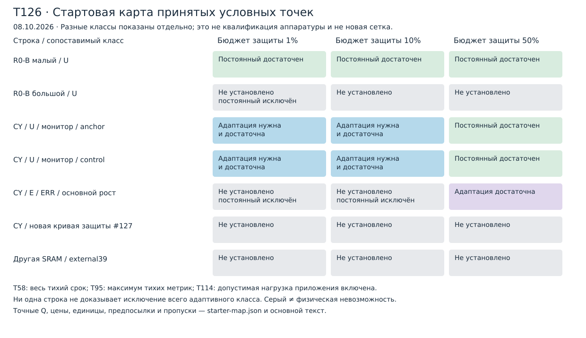

# T126. Простая карта режимов на принятых условиях

Issue [#126](https://github.com/z3tm4n-x/phd-adaptive-memory-ecc/issues/126),
база `67bf34b4f06a0410461e728f4217b8c58f704b04`, 08.10.2026.
**Начальная теоретическая передача, не завершение инженерной карты.**
Первая простая карта/таблицы/код и перечень пробелов — 14.10, Москва.
[План до перебора](../experiments/t126-regime-map/PLAN.md),
[приложение](t126-regime-map-appendix.md),
[машинная карта](../experiments/t126-regime-map/starter-map.json),
[передача](../experiments/t126-regime-map/HANDOFF.md).
Принятые научные файлы, RES и паспорт не изменены. T119 до #122 — кандидат.

## 1. Точное утверждение, предпосылки и статус

**Задача процедуры:** для явно объявленного класса памяти, среды, сервиса,
наблюдений и приложения предъявить принятый сертификат
\(\sup_{\lambda\in\Lambda,\theta\in\Theta}\Pr^\pi(A_T)\le U_\pi\le\varepsilon\),
цену и ресурс; необходимые исключения считать отдельно. Здесь
\(A_T=\{\exists t\in[0,T],w:\mathrm{wt}(E_w(t))>1\}\) — первое превышение
на **всех** позициях защищаемого слова, не только data и не только при чтении.
Это не новая универсальная теорема классификации и не новый алгоритм ECC.

Обязательный вход каждой строки:

1. Полное число позиций \(n\), число слов \(W\), отображение физических
   позиций/MCU, исправляющая способность; \(T,\varepsilon\), начальные
   остатки/pending и их общая квота. Внутренний 32+6: \(n=38\);
   внешний SEC-DED(39,32): \(n=39\), не взаимозаменяемы.
2. Точный закон ошибок: экзогенность интенсивности, независимость меток
   разных родителей, пространственные верхние **и отдельно нижние** условия,
   режим инверсии/восстановления. В T52 \(\lambda\) — родители/с на массив;
   в T80/T95 \(\nu\) — верх суммы непрямых словесных касаний.
   Равенство \(\lambda=nWr\) допустимо только в соответствующем одиночном
   законе с интенсивностью \(r\) на позицию. ERR сам не объявляется Poisson.
3. Среда: \(\lambda=b+s\le B\), \(0\le b\le\bar b\), \(s\ge0\),
   \(\int s\le F_S\); при наличии независимые ограничения \(F,S_2\),
   рост с порогом, правила начала и экзогенного разделения фаз.
   Ретроспективная часовая/пятиминутная серия не квалифицирует непрерывный рост.
4. Сервис U/C/E, полный календарь, clocks, атомарные запросы, исправление
   между snapshot и release, нижняя стоимость обязательного чтения,
   all-history верх операций, FIFO/приложение, пик, deadline и запас.
   Нижняя цена не выводится из одного верхнего WCET.
5. Канал со всеми задержками, статистикой, потерями и восстановлением;
   **одни** lifetime-квоты за \([0,T]\), конечное численное принятие действия,
   допустимое поведение на плохих историях и их цена. Никакого нового
   \(\varepsilon\) после вспышки/возврата/восстановления канала.
6. Метрика цены: спокойная защита — основная; средняя за срок рядом.
   Наблюдение записей, канал, управление, возвраты и плохие истории оплачены.
   Полезные обращения приложения показываются отдельно в полной шине.
   Соперник совпадает по всем условиям 1–5 и метрике, не только по \(D_*\).

Известные инструменты — пуассоновские моменты и ячеечные вероятности.
Принятые достаточные результаты — T52/T58, T80/T95, T114.
Новое здесь — определения/применение и только адресная необходимая граница
с новым \(S_2\) (приложение А). Физические неизвестные остаются неизвестными.
Требование при расчётных солнечных флюенсе/пике с вероятностью превышения
\(\Pi=0{,}1\) — **условный** проектный уровень: \(\Pi\) не добавляется
молча к \(\varepsilon\) и не исчезает из безусловного утверждения.

## 2. Координаты, не заменяющие контракт

В равномерном независимом singleton-XOR законе
\(k=(n-1)/(2nW)\) и принятый парный член постоянного U — \(kPS_2\).
Для общего marked-закона нужны коэффициенты T52
\(k=\frac12\sum_w\eta_w\), а не автоматическая подстановка \(n,W\).
В ERR-сопряжении T114 используется \(\beta_0=1/(2W)\), включая оплату
XOR-скрытия; координата singleton-\(k\) **не заменяет** этот коэффициент.

\(D_*\) — верх \(\mathbb E N_D\) числа прямых многобитовых родителей.
Он отличается от истинной вероятности прямого превышения и её верхней оценки.
T80/T114 оплачивают \(D_*\); форма \(1-e^{-dF}\) T52 требует своего
пуассоновского договора. «Прямая ионизация протоном» — физический механизм,
который может увеличить одиночную \(\lambda\); это не синоним \(N_D\).

Для **одной** траектории определим без двойного счёта
\[
S_{2,b}=\int_0^T b^2dt,\qquad
S_{2,s}=\int_0^T(2bs+s^2)dt,\qquad S_2=S_{2,b}+S_{2,s}.
\]
Фон интегрируется за весь срок, в том числе во вспышках. Смешанный член
целиком отнесён к солнечному избытку. Тогда координаты автора:
\[
\delta=D_*/\varepsilon,\qquad
\sigma=kP_{\min}S_{2,s}/\varepsilon,\qquad
\eta=S_2/S_{2,b}.                                           \tag{1}
\]
Цена постоянного относительно положительного бюджета \(B_C\) задаётся
\(\kappa_F=C_F^*/B_C\) с доказанным интервалом
\([C_F^-/B_C,C_F^+/B_C]\). Неизвестный конец интервала остаётся неизвестным;
один upper \(\kappa_F>1\) не исключает класс.
Для нулевого знаменателя: положительный числитель даёт \(+\infty\),
\(0/0\) — «не определено», отсутствующий вход — «неизвестно».
\(1+CV^2=T\int\lambda^2/(\int\lambda)^2\) — другая характеристика.

Принятый rarity-верх:
\[
\bar S_2=\min\{B^2T,\,B\min(BT,\bar bT+F_S),\,
                   \bar b^2T+(B+\bar b)F_S\}.              \tag{2}
\]
При новых caps используется уже принятая операция минимума T52.
Отношение двух верхних оценок **не** является верхом истинной \(\eta\).
В начальной таблице поэтому отдельно записана \(\eta_{ref}\) для допустимого
эталона «фон \(\bar b\), начальное плато, затем фон», а \(\eta_{actual}=null\).
При новом cap заново проверяется допустимость эталона; его отношение не
переименовывается в свойство всех траекторий. Если известны только интервалы,
отношение ограничивается через согласованные верх/низ при положительном
нижнем знаменателе; иначе эта координата не установлена.

\(P_{\min}\) — минимум **полного ресурсно допустимого календарного периода**
в названном семействе при фиксированном приложении, без ограничения целевой
средней цены. Отдельно храним необходимый нижний предел и минимум лишь
достаточных ресурсных тестов. Для T58 последний получается монотонным
поиском по всему целочисленному диапазону: слот, маска пика, FIFO, deadline.
К цене затем добавляется её собственный тест. Для T95/T114 выбранный
\(P_s=Wg\xi\) не объявляется глобальным \(P_{\min}\); \(Wc\) — занятость,
не период. Часы/запас 10% включаются в прежние тесты, не после них.
Для старой условной T58 запас требует отдельного \(WCET\le c/1{,}1\)
при сохранённом полном резерве \(c\); измеренного подтверждения нет.

**\(\delta\ge1\), \(\delta+\sigma\ge1\) — не доказательства невозможности.**
Это координаты расхода достаточного бюджета. Они не дают lower \(Q(T)\).

## 3. Информативность и применение достаточных формул

\(\chi_{info}\) — вектор, не новая достаточная статистика и не
\(\chi_{pair}=\sum\eta_w\) из T52:

| Канал | Обязательные параметры принятой формулы |
|---|---|
| ERR / T114 | \(a,\zeta,\phi=(a-1/W)_+\); \(\tau\) раскрытия по фактическим фазам E и приложения; \(w,h\), delivery/loss; ложные флаги, outages/recoveries; общий рост \(\rho,\ell\), lifetime-квоты |
| Монитор / T80–T95 | lower/MGF и отдельный тихий upper; \(a_M,A_M,b_U,\eta_M\); окно/шаг/доставка, пригодность/LOW-expiry; \(\rho_e,\rho_b,q_R,D_Q,v_e,\ell\); статистика, потери/возвраты и цена |
| Орбита / итерация 2 | доступные координаты/время, погрешность/свежесть/пропуски, условная огибающая среды и её покрытие; цена доступа. Пока полного принятого lifetime-моста нет |

Проекции вроде \(\rho\tau\) полезны как подписи, но две строки с одинаковой
проекцией могут иметь разные экспозиции/ложные тревоги. Условия T80 (4)–(5)
совместно используют быстрый ретроспективный конус, медленный будущий вход
и цену тревог; T114 (3)–(4) — Poisson-токены старых фаз и один lifetime-риск.
Рост T95 с медленным входом не объединяется с основным \(\rho=0{,}048\)
T114 в один минимум цены.

| Применяемая ветвь | Проверка и ограничения |
|---|---|
| Постоянный T52/T58 | T52 (4)–(6): начало, direct, \(kPS_2\), cross и blind-service; (8)–(10): полный ресурс. До 42 рациональных ветвей; целочисленные корни и окончательная проверка. Наибольший период сертификата ≠ истинный оптимум; уменьшение периода при члене \(1/P\) может быть небезопасно |
| U + монитор T95 | T95/приложение В и принятый T88-row: исходные вложенные фазы, начальный проход, ERR, LOW/удержания, распознанные потери. Сохраняется единая история; нельзя склеить два сертификата запусков |
| E + ERR T114 | T114 (3)–(4), приложения Б–Г: старые Poisson-клетки, \(\beta_0\), E-cross, наблюдаемые записи; `calculate.py` с направленной арифметикой. Только существующие семейства/профили, не новый joint-сертификат T119 |

Численные проверки не заменяют доказательств. При пропуске любого критического
контракта — условная строка или «не установлено», не нулевой риск/стоимость.

## 4. Необходимость и решение по карте

Для постоянного класса сначала проверяется допустимый singleton-свидетель
с тем же полным словом, приложением и \(\Lambda/\Theta\), затем ячеечный
lower T52/T95. Новый \(S_2\) уменьшает допустимую длину плато; формула и
доказательство — приложение А. Для E удаляется всё E-окно, но в нижнюю
цену входит только обязательное чтение. Верх direct не вычитается из
\(\varepsilon\) необходимого теста. Произвольные фазы требуют края
\(2Wc/T\), не \(2c/T\). Опора на zero-app свидетеля допустима только
если нулевой поток входит в общий envelope, как в T114.

| Цвет/статус | Достаточное основание присвоения |
|---|---|
| Постоянный достаточен | Предъявлен постоянный с верхом риска/цены и всеми ресурсами в бюджете |
| Адаптация нужна и достаточна | Lower **всего сопоставимого** постоянного класса исключает бюджет; предъявлен адаптивный верх в бюджете |
| Адаптация достаточна | Адаптивный верх проходит; необходимость не доказана |
| Класс периода исключён | Lower риска всего явно объявленного класса управления больше \(\varepsilon\) |
| Не установлено | Ни одного из предыдущих достаточных комплектов доказательств нет; причина хранится отдельно |

В последнем статусе можно одновременно знать «постоянный исключён».
Для четвёртого нельзя подставить самый частый проверенный период в upper.
В этой поставке **ни одна опорная точка не получает четвёртый статус**.
Принятая нижняя direct-граница T52, приложение Д.3, требует \(d_*>0\)
опасной метки **из любого** корректируемого состояния; верх \(D_*\)
и просто двухбитовая XOR-метка этого не дают. Сравнение с более частым
или всеведущим исправлением без принятого доказательства не используется.

Если \(C_F^-\le\inf_{\pi\in\mathcal F}C(\pi)\le C_F^+\),
а \(C_A\le C_A^+\), коэффициент выигрыша не меньше \(C_F^-/C_A^+\)
для той же метрики. Цена найденного постоянного — верх, не нижняя цена класса.
Конечный минимум предъявленных адаптивных строк не глобальный оптимум.

## 5. Начальная карта и полный смысл цен

**A1, малый R0-B.** Условный T58, \(n=39,W=262144,R_{eff}=64\) Мбит/с,
\(T=157766400\) с, \(\varepsilon=0{,}01\): постоянный
\(P=20{,}18037184\) с, налог \(\le0{,}791581054\%\), риск
\(\le0{,}009999999998\); пик/задержка проходят прежний envelope.
Это не будущая физическая гарантия. Полная шина включает \(u+\sigma/T\)
приложения; returning-тихий договор заимствовать у T95 нельзя.

**A2, большой R0-B.** \(W=1935832,R_{eff}=256\) Мбит/с, тот же диагностический
per-bit класс: lower \(\ge0{,}011383658341>0{,}01\) исключает постоянный
U с налогом \(\le1\%\). Адаптивный lifetime-верх в этой строке не предъявлен.
Исторические 12,3874× магистерской — отношение проходов в ином конечном
сравнении; RES-002 — 600-секундные окна с post-W моделью. Ни то, ни другое
не заполняет этот пробел автоматически.

**A3, CY62167 — один пример, разные фасеты, не конкуренты друг другу.**
T95/U при \(D_*=0{,}0002802445\): интервал постоянной тихой цены
[33,676261830923%; 47,135788025679%], адаптивный тихий верх 0,287444410%,
коэффициент \(\ge117{,}1574\). Контроль \(D_*=5\cdot10^{-5}\):
верх 0,208179835%, коэффициент \(\ge161{,}7652\).
Монитор/WCET не квалифицированы; это воспроизведение условного большого
выигрыша. Миссионный верх в таблице — только грубый принятый all-FAST cap,
не доказательство такого же миссионного коэффициента.

T114/E/main, \(a\ge0{,}9,\zeta\le0{,}1\), \(g=196,k_a=3,w/h=90/180\):
риск \(\le0{,}000993692053\), тихий intercept 16,7193081%,
миссионный 17,444926435%. Наблюдаемая запись добавляет
\(92{,}500920\text{ нс}\cdot r_w\) к защите. При общем burst=1 и
предъявленном в T114 пределе частоты \(r_\Sigma\le181157{,}4160/\text{с}\)
получены верх защиты **18,39503090% тихий / 19,12064920% за срок**;
для тихих компонент учтено расширение на 3 мкс и краевые запросы.
Полная шина вместо этой добавки использует
\(217{,}002160\text{ нс}\cdot r_w+185{,}001840\text{ нс}\cdot r_r\):
20,65046319% / 21,37608150%. Наблюдение не оплачивается второй раз.

Необходимая цена постоянного E \(\ge30{,}813724572349\%\);
его предъявленный миссионный верх на том же envelope \(\le45{,}31373452\%\).
Миссионный коэффициент двухступенчатого \(\ge1{,}6115\), без нулевой нагрузки.
Одноступенчатый сохранён отдельной строкой данных, не удалён при выборе.
Миссионный scalar постоянного E не переименован в returning-тихий upper;
его адресный экспорт принятой цены включён в передачу инженеру.
Прежнее ресурсное исключение постоянного E для 2,5 г/см² сохраняется только
в прежнем условном классе; новая кривая всех толщин ждёт конкретных входов #127.

**A4, другая SRAM/external39.** Пока нет подтверждённого образца/ревизии
и переносимой низкоэнергетической протонной кривой. Это видимая пустая строка,
не нулевой direct. Первичная библиографическая зацепка и барьер доступа
сохранены в [SOURCES](../experiments/t126-regime-map/SOURCES.md).
**Пятый пример** SAC-C/орбита — только сбор входов второй итерации; данные
ICARE не становятся скрытым полётным каналом.

## 6. Конечный расчёт и суть для автора

До подбора опубликованы PLAN и `grid.json`: 36 комбинаций R0-B из
двух W, двух скоростей, трёх \(\varepsilon\) и трёх бюджетов; прежние
ресурсы/полный диапазон периодов. CY — согласованные наборы #127 и
принятые конечные семейства T95/T114, U/E и классы роста отдельно.
Одна адресная детализация границ; нет интерполяции доказанных цветов.
Численную карту ведёт инженер после #127 через оркестратора.

Сейчас воспроизведены принятые T58/T95/T114; новые проверки ограничены
необходимым свидетелем и арифметикой применения. При искусственном
\(S_2\)-cap 1/2 и 1/4 старого эталона новая нижняя цена U равна
16,81803269% и 8,38716466% вместо 33,67626183%: перенос прежнего lower
без проверки дал бы неверный вывод о необходимости адаптации.

**Суть для автора.** Процедура, формулы, статусы, начальная карта и точная
передача опубликованы без перезапуска исследований. Условный большой
тихий выигрыш есть; квалифицированного большого выигрыша пока не заявлено.
Главные пробелы: входы #127, четвёртый образец, lifetime-мост для большого
R0-B и часть сопоставимой тихой цены E. Они не превращены в «невозможность»
и не отложили публикацию готовой части. Контроль первой полной простой
поставки остаётся **14 октября**; R0-A не единственная цель программы.
